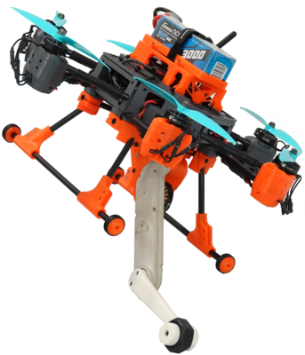

# Borinot 🐝

Borinot is an open-source Unmanned Aerial Loco-Manipulator, developed by the HiDRo group. This torque-controlled robot is designed for hybrid flying and contact loco-manipulation. It utilizes its extremity as a tail for flying locomotion, a hand for agile aerial manipulation, or a leg for hybrid aerial-contact locomotion. You can watch Borinot in action [here](https://www.youtube.com/watch?v=Ob7IIVB6P_A).

<!-- Quick section of the main software associate with it: eagle_mpc_lib -->
<!-- Add section ## Why Borinot Exists -->

## Assembly and Setup Guide  
Before deploying Borinot, ensure proper assembly and configuration. For detailed hardware assembly instructions, refer to:  

- **[Hardware Guide](hardware/README.md)** - Step-by-step instructions for assembling Borinot, including a complete components list and building process.
  
- **[Software Setup](software/README.md)** - Guide to Borinot's software stack installation, configuration, and subsystem integration. 

If you encounter any difficulties during assembly or setup, our [Troubleshooting](resource/troubleshooting.md) section is here to help.

## How to Use Borinot
To use Borinot, we've made a set of guides to help you get started with it:

- [Preflight Checks](resource/preflight.md) - This document contains a checklist of preflight checks that must be performed before operating Borinot to ensure its safety and reliability.
- [Optitrack fusion](resource/optitrack.md) - This document explains how to fuse data from the Optitrack motion capture system and the PX4 flight controller to obtain accurate position and orientation estimates for Borinot.
- [MPC Controller](resource/mpc.md) - This document provides an overview of the Model Predictive Controller (MPC) used to control Borinot's hybrid locomotion, and explains how to run simulations and experiments with the controller.

## Citing
If you use Borinot in your research work, please acknowledge our work by citing the following paper:

> J. Martí-Saumell, H. Duarte, P. Grosch, J. Andrade-Cetto, A. Santamaria-Navarro, J. Solà. Borinot: an open thrust-torque-controlled robot for research on agile aerial-contact motion. arXiv preprint arXiv:2307.14686, 2023.

## License

Borinot is licensed under the BSD 3-clause license. You can read the full license [here](LICENSE).

[Back to HiDRo Group](../profile/README.md)
