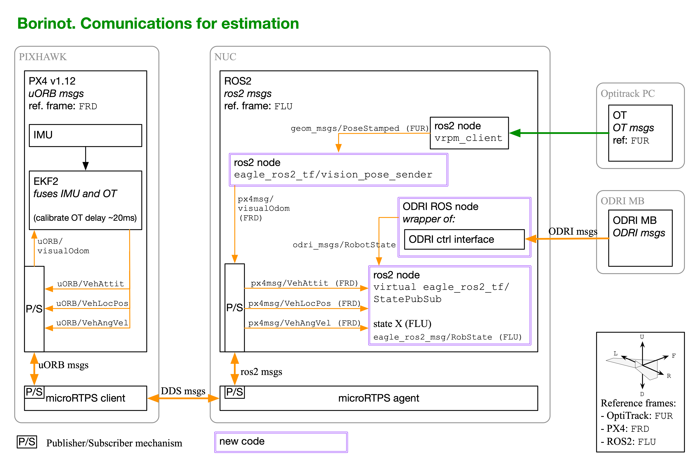
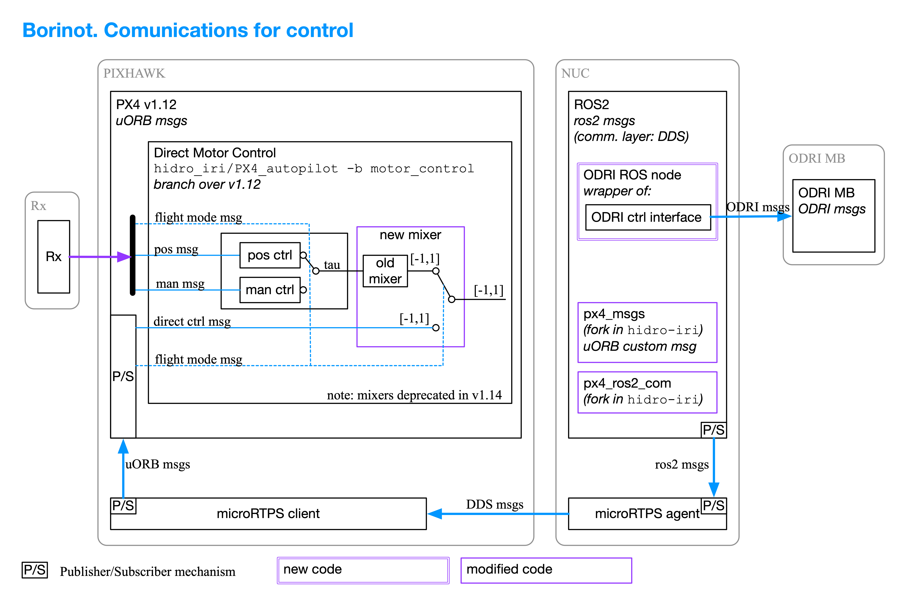

# Borinot architecture

Borinot consists of hardware and software, both within the robot body and outside as necessary support elements.

This chapter describes the architecture. 

> You can click on the images below to get them in full resolution.

## Hardware

The Borinot robot consists of a flying platform and an arm, and is supported by some external equipments such as the Radio controller, the WIFI router, Optitrack and the base station or Laptop.

## Software

Borinot runs many pieces of software. Here, we detail the information flow for *estimation* (from sensors to computer) and *control* (from computer to motors). We also show the data flow for *simulations*.

### Software for state estimation

State estimation consists of fusing Borinot's IMU data with Optitrack position and orientation data.

The fusion is performed in the PixHawk unit by the EKF2 module.

The IMU data is gathered directly by PX4 in PixHawk

The Optitrack data is transferred from the Optitrack computer via wifi to Borinot's NUC, then via Ethernet to PX4 in Pixhawk.

The result of the estimation is send back to the NUC.

Additionally, the ODRI master board reports the arm state to the NUC via Ethernet.

The state `X` is located in the ROS2 node `StatePubSub`

Beware there are thre different reference frame conventions:
  - Optitrack uses `FUR`
  - PX4 uses `FRD`
  - ROS2 and Eagle MPC use `FLU`
  - The node `StatePubSub` in NUC transforms messages

### Software for Control

### Software for Simulation

---

| [Top of page](#architecture) | [Back to Borinot HOME](../README.md) |
| --- | --- |
