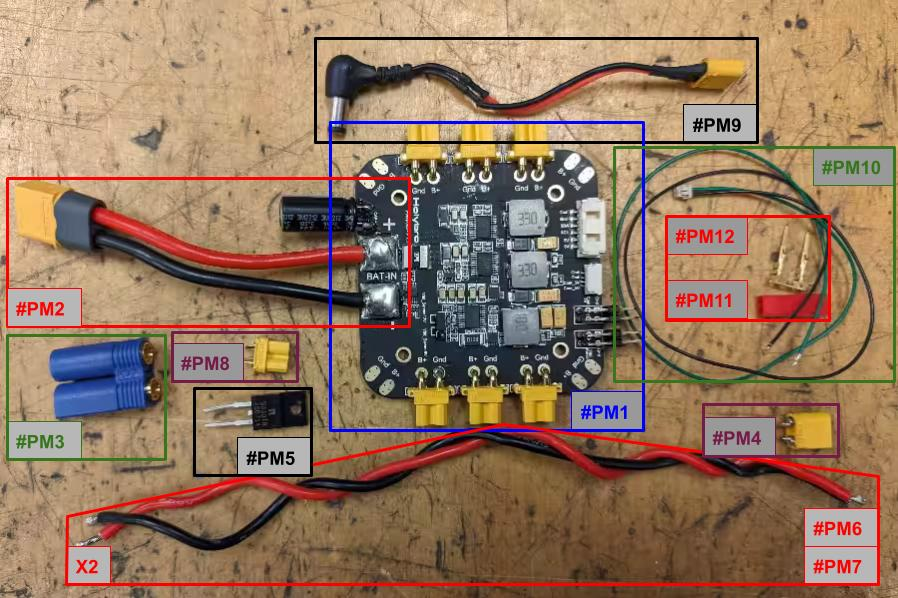
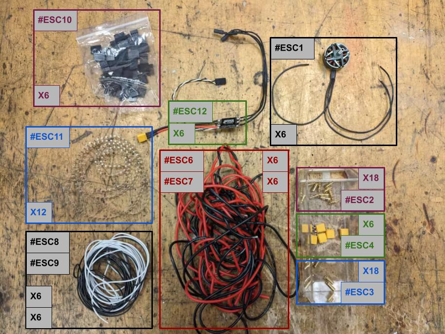
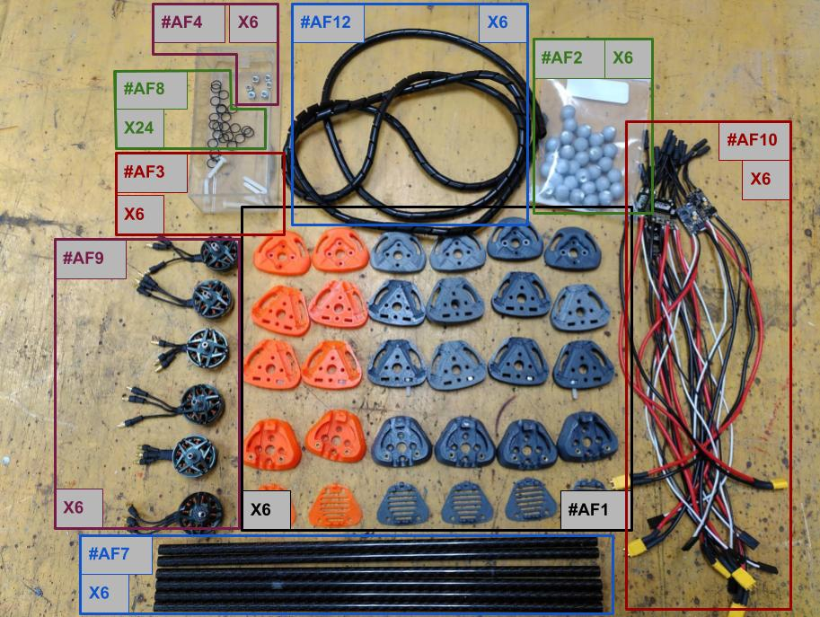
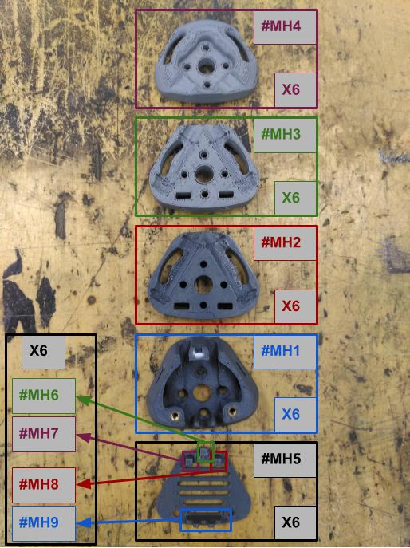

# Components List

Before beginning assembly, ensure you have all necessary components on hand. This page is divided into assembly sections. In each section there is an image with each component in a box with an id followed by a table with the following columns:
- ID: The ID seen in the image. It will be used for reference to each component in the instructions.
- Part name: The name of the component.
- Qty: Quantity needed.
- Description: A small description of the component.
- Location: Where is stored in IRI. `HS`.. -> Hidro shelves, `WS` -> Workshop, `P` -> To print
- Reference: Reference shop to buy it.

## Power Module Modification

| ID      | Part Name             | Qty | Description                          | Location | Reference             |
|---------|-----------------------|-----|--------------------------------------|----------|-----------------------|
| `#PM1`  | PM03D Power Module    | 1   | Base unit                            | HS-      | Holybro               |
| `#PM2`  | Battery Cable         | 1   | Battery connector                    | HS-      | -                     |
| `#PM3`  | EC5-M Connector       | 1   | Male battery connector               | HS-      | TME                   |
| `#PM4`  | XT30-M Connector      | 1   | Male power connector                 | HS-      | RC Innovations        |
| `#PM5`  | Diode                 | 1   | BQ30TB 45B714                        | HS-      | -                     |
| `#PM6`  | Red Power Cable       | 2   | 15cm 16AWG Silicon                   | HS-      | RC Innovations        |
| `#PM7`  | Black Power Cable     | 2   | 15cm 16AWG Silicon                   | HS-      | RC Innovations        |
| `#PM8`  | XT30-F Connector      | 1   | Male power connector                 | HS-      | RC Innovations        |
| `#PM9`  | Computer Cable        | 1   | 24cm barrel plug (5.5×2.5mm)         | HS-      | Amazon                |
| `#PM10` | Masterboard Cable     | 1   | 17cm line                            | HS-      | ODRI                  |
| `#PM11` | Connector JST         | 1   | Male and female connector            | HS-      | RC Innovations        |
| `#PM12` | JST crimps            | 2x2 | Crimps for JST connector             | HS-      | RC Innovations        |

## Brushless Motor and ESC Modification

| ID       | Part Name              | Qty | Description                          | Location | Reference             |
|----------|------------------------|-----|--------------------------------------|----------|-----------------------|
| `#ESC1`  | TMotor F90-1300KV      | 6   | Brushless motor and phase cables     | HS-      | TMotor                |
| `#ESC2`  | Banana Plug (male)     | 18  | 3.5 mm male banana plugs             | -        | RC Innovations        |
| `#ESC3`  | Banana Plug (female)   | 18  | 3.5 mm female banana plugs           | -        | RC Innovations        |
| `#ESC4`  | XT30-M Connector       | 6   | Male power connector                 | HS-      | RC Innovations        |
| `#ESC5`  | XT30-F Connector       | 1   | Female power connector               | HS-      | RC Innovations        |
| `#ESC6`  | Red Power Cable        | 6   | 30cm Red Silicone 16 AWG cable       | HS-      | RC Innovations        |
| `#ESC7`  | Black Power Cable      | 6   | 30cm Black Silicone 16 AWG cable     | HS-      | RC Innovations        |
| `#ESC8`  | White Servo Cable      | 6   | 30cm Silicone 26 AWG cable in White  | HS-      | RC Innovations        |
| `#ESC9`  | Black Servo Cable      | 6   | 30cm Silicone 26 AWG cable in White  | HS-      | RC Innovations        |
| `#ESC10` | Female Servo Connector | 6   | Female servo connector               | HS-      | RC Innovations        |
| `#ESC11` | Servo Connector Crimps | 12  | Female servo connector crimps        | HS-      | RC Innovations        |
| `#ESC12` | TMotor F35A 6s         | 6   | ESC                                  | HS-      | TMotor                |

## Airframe Assembly

| ID       | Part Name              | Qty | Description                          | Location | Reference             |
|----------|------------------------|-----|--------------------------------------|----------|-----------------------|
| `#AF1`   | Motor holder           | 6   | 3D printed motor and ESC holder      | HS-      | [CAD files](./0_components_list.md#motor-holder-parts)              |
| `#AF2`   | M4 Marker              | 6   | 14 mm M4 Optitrack markers           | HS-      | OptiTrack             |
| `#AF3`   | M4 Nylon Screws        | 6   | 12 mm M4 Nylon screws with any head  | WS       | -                     |
| `#AF4`   | M4 nuts                | 6   | M4 nuts                              | WS       | -                     |
| `#AF5`   | M3 inserts             | 12  | M3 inserts                           | WS       | -                     |
| `#AF6`   | M3x30mm Screws         | 24  | 30 mm M3 screw with cylindric head   | WS       | -                     |
| `#AF7`   | Carbon Fiber Tubes     | 6   | ø8 mm x 352.5 mm, Round Checked      | WS       | -                     |
| `#AF8`   | O-ring Seals           | 24  | ø8 mm                                | WS       | -                     |
| `#AF9`   | Modified Motors        | 6   | Modified motors in previous section  | HS-      | -                     |
| `#AF10`  | Modified ESC           | 6   | Modified ESC in previous section     | HS-      | -                     |
| `#AF11`  | M3x6mm Screws          | 12  | 6 mm M3 screws with cone head        | WS       | -                     |
| `#AF12`  | Spiral cable wrap      | 6   | -                                    | HS-      | -                     |

## Motor Holder parts

| ID       | Part Name              | Qty | Description                          | Location | Reference             |
|----------|------------------------|-----|--------------------------------------|----------|-----------------------|
| `#MH1`   | Motor holder bottom    | 6   | 3D printed part                      | HS-      | [motor_holder_d.STEP](./cad_files/main_body/motor_holder_d.STEP)      |
| `#MH2`   | Motor lower middle     | 6   | 3D printed part                      | HS-      | [motor_holder_c.STEP](./cad_files/main_body/motor_holder_c.STEP)      |
| `#MH3`   | Motor top middle       | 6   | 3D printed part                      | HS-      | [motor_holder_b.STEP](./cad_files/main_body/motor_holder_b.STEP)      |
| `#MH4`   | Motor holder top       | 6   | 3D printed part                      | HS-      | [motor_holder_a.STEP](./cad_files/main_body/motor_holder_a.STEP)      |
| `#MH5`   | Motor holder cover     | 6   | 3D printed part                      | HS-      | [motor_holder_i.STEP](./cad_files/main_body/motor_holder_i.STEP)      |
| `#MH6`   | internal middle aux    | 6   | 3D printed part                      | HS-      | [motor_holder_h.STEP](./cad_files/main_body/motor_holder_h.STEP)      |
| `#MH7`   | internal left aux      | 6   | 3D printed part                      | HS-      | [motor_holder_e.STEP](./cad_files/main_body/motor_holder_e.STEP)      |
| `#MH8`   | internal right aux     | 6   | 3D printed part                      | HS-      | [motor_holder_f.STEP](./cad_files/main_body/motor_holder_f.STEP)      |
| `#MH9`   | external aux           | 6   | 3D printed part                      | HS-      | [motor_holder_g.STEP](./cad_files/main_body/motor_holder_g.STEP)      |

## Upper Part

<!-- Put Picture of all the piece of the upper part -->
<!-- Plus comment of the picture -->

| Part Name             | Quantity | Description                          | Reference                                                                                   |
|-----------------------|----------|--------------------------------------|---------------------------------------------------------------------------------------------|
| PM03D Power Module    | 1        | Base unit                            | [Holybro](https://holybro.com/products/pm03d-power-module)                                  |
| EC5-M Connector       | 1        | Male battery connector               | [TME](https://www.tme.eu/es/en/details/ec5-m/dc-power-connectors/amass/)                    |
| XT30-F Connector      | 1        | Female power connector               | [RC Innovations](https://rc-innovations.es/shop/amass-conector-xt30-hembra-xt30u-h)         |
| XT30-M Connector      | 1        | Male power connector                 | [RC Innovations](https://rc-innovations.es/shop/amass-conector-xt30-macho-xt30u-m)          |
| Diode                 | 1        |                                      | `BQ30TB 45B714`                                                                             |
| Red Power Cable       | 2        | 15cm 16AWG (VCC)                     | [RC Innovations](https://rc-innovations.es/shop/Cable-silicona-16AWG-Rojo-1-metro-amass)    |
| Black Power Cable     | 2        | 15cm 16AWG (GND)                     | [RC Innovations](https://rc-innovations.es/shop/cable-de-silicona-26-awg-negro-1-metro)     |
| Computer Cable        | 1        | 24cm barrel plug (5.5×2.5mm)         | [Amazon](https://www.amazon.com/Generic-5-5mm-2-5mm-Right-Pigtail/dp/B07H38LNPD)            |
| Masterboard Cable     | 1        | 17cm line                            |                                                                                             |
| Connector JST         | 1        | Male                                 |                                                                                             |

| Part Name | Quantity | Type | Assembly Reference |
|:-|:-:|:-:|:-|
| [Motor Cases](CAD/motor_case/) | 6 | 3D part | [Airframe Assembly](building_instructions.md#airframe-assembly) |
| [Body Case](CAD/body_case/) | 1 | 3D part | [Body Assembly](building_instructions.md#body-assembly) |
| [Landing Gear](CAD/landing_gear/) | 1 | | [Landing Gear Assembly](building_instructions.md#landing-gear-assembly) |
| [Controller Case](CAD/controller_case/) | 1 | | [Controller Assembly](building_instructions.md#controller-assembly) |
| [2DOF Flying Arm](CAD/flying_arm/) | 1 | | [Flying Arm Assembly](building_instructions.md#flying-arm-assembly) |
| [TMotor F90-1300KV](https://store.tmotor.com/goods.php?id=1064) | 6 | | [Airframe Assembly](building_instructions.md#airframe-assembly) |
| [TMotor F35A 6s](https://store.tmotor.com/goods.php?id=1176) | 6 | | [Airframe Assembly](building_instructions.md#airframe-assembly) |
| [NUC i7](https://ark.intel.com/content/www/us/en/ark/products/series/217835/intel-nuc-kit-with-12th-generation-intel-core-processors.html) | 1 | | [Body Assembly](building_instructions.md#body-assembly) |
| [PixHawk5](https://docs.px4.io/main/en/flight_controller/pixhawk5x.html) | 1 | | [Body Assembly](building_instructions.md#body-assembly) |
| ø**...**mm O-ring Seals | 24 | | [Airframe Assembly](building_instructions.md#airframe-assembly) | <!--Mechanical Components-->
| ø20mm O-ring Seals | 12 | | [Landing Gear Assembly](building_instructions.md#landing-gear-assembly) |
| M3x5mm Screws | 12 | | [Airframe Assembly](building_instructions.md#airframe-assembly) |
| M3x10mm Screws | 8 | | [Landing Gear Assembly](building_instructions.md#landing-gear-assembly) |
| M3x10mm Nylon Screws | 6 | | [Airframe Assembly](building_instructions.md#airframe-assembly) |
| M3x16mm Screws | 8 | | [Landing Gear Assembly](building_instructions.md#landing-gear-assembly) |
| M3x30mm Screws | 24 | | [Airframe Assembly](building_instructions.md#airframe-assembly) |
| M4 Nuts | 6 | | [Airframe Assembly](building_instructions.md#airframe-assembly) |
| M3 Nuts | 16 | | [Landing Gear Assembly](building_instructions.md#landing-gear-assembly) |
| M3 Inserts | 12 | | [Airframe Assembly](building_instructions.md#airframe-assembly) |
| Cable Ties | 6 | | [Body Assembly](building_instructions.md#body-assembly) |
| ø8mmx110.0mm Carbon Fiber Round Tubes | 4 | | [Landing Gear Assembly](building_instructions.md#landing-gear-assembly) |
| ø8mmx170.0mm Carbon Fiber Round Tubes | 2 | | [Landing Gear Assembly](building_instructions.md#landing-gear-assembly) |
| ø8mmx300.0mm Carbon Fiber Round Tubes | 2 | | [Landing Gear Assembly](building_instructions.md#landing-gear-assembly) |
| ø8mmx352.5mm Carbon Fiber Round Tubes | 6 | | [Airframe Assembly](building_instructions.md#airframe-assembly) |
| [Markers](https://optitrack.com/accessories/markers/#mcm-14.0-m4-10) | 11 | | [Airframe Assembly](building_instructions.md#airframe-assembly) & [Body Assembly](building_instructions.md#body-assembly)|

## Lower Part

## Electronics

- **Computer:** Intel [NUC i7](https://ark.intel.com/content/www/us/en/ark/products/series/217835/intel-nuc-kit-with-12th-generation-intel-core-processors.html)
- **Flight Controller:** [PixHawk5](https://docs.px4.io/main/en/flight_controller/pixhawk5x.html)
- **Power Module:** [PM03D Power Module](https://holybro.com/collections/power-modules-pdbs/products/pm03d-power-module)
- **ESC:** [TMotor F35A 6s](https://store.tmotor.com/goods.php?id=1176)
- **Control Board:** [Master board](https://github.com/open-dynamic-robot-initiative/master-board#master-board) from [ODRI](https://github.com/open-dynamic-robot-initiative)
- **Driver:** [Micro Driver](https://github.com/open-dynamic-robot-initiative/open_robot_actuator_hardware/tree/master/electronics/micro_driver_electronics) from ODRI
- **Actuator:** [Actuator Module](https://github.com/open-dynamic-robot-initiative/open_robot_actuator_hardware/blob/master/mechanics/actuator_module_v1/README.md) from ODRI

## 3D Printed Parts

- **Motor Case:** Comprising a *top*, two *middles*, a *bottom*, and a *cache*.
- **Body Case:** Consisting of a *top*, a *crown*, a *bottom*, and two sizes of *tube holders (S,M, and L)*.
- **Landing Gear:** Including four *attachments*, four *feet*, and four *pawns*.
- **Controller Case:** Consisting of a *top* and a *bottom*.
- **2DOF Flying Arm**

## Bill of Materials - Borinot

| Part Name | Quantity | Comments | Assembly Reference |
|:-|:-:|:-:|:-|
| [Motor Cases](CAD/motor_case/) | 6 | | [Airframe Assembly](building_instructions.md#airframe-assembly) |
| [Body Case](CAD/body_case/) | 1 | | [Body Assembly](building_instructions.md#body-assembly) |
| [Landing Gear](CAD/landing_gear/) | 1 | | [Landing Gear Assembly](building_instructions.md#landing-gear-assembly) |
| [Controller Case](CAD/controller_case/) | 1 | | [Controller Assembly](building_instructions.md#controller-assembly) |
| [2DOF Flying Arm](CAD/flying_arm/) | 1 | | [Flying Arm Assembly](building_instructions.md#flying-arm-assembly) |
| [TMotor F90-1300KV](https://store.tmotor.com/goods.php?id=1064) | 6 | | [Airframe Assembly](building_instructions.md#airframe-assembly) |
| [TMotor F35A 6s](https://store.tmotor.com/goods.php?id=1176) | 6 | | [Airframe Assembly](building_instructions.md#airframe-assembly) |
| [NUC i7](https://ark.intel.com/content/www/us/en/ark/products/series/217835/intel-nuc-kit-with-12th-generation-intel-core-processors.html) | 1 | | [Body Assembly](building_instructions.md#body-assembly) |
| [PixHawk5](https://docs.px4.io/main/en/flight_controller/pixhawk5x.html) | 1 | | [Body Assembly](building_instructions.md#body-assembly) |
| ø**...**mm O-ring Seals | 24 | | [Airframe Assembly](building_instructions.md#airframe-assembly) | <!--Mechanical Components-->
| ø20mm O-ring Seals | 12 | | [Landing Gear Assembly](building_instructions.md#landing-gear-assembly) |
| M3x5mm Screws | 12 | | [Airframe Assembly](building_instructions.md#airframe-assembly) |
| M3x10mm Screws | 8 | | [Landing Gear Assembly](building_instructions.md#landing-gear-assembly) |
| M3x10mm Nylon Screws | 6 | | [Airframe Assembly](building_instructions.md#airframe-assembly) |
| M3x16mm Screws | 8 | | [Landing Gear Assembly](building_instructions.md#landing-gear-assembly) |
| M3x30mm Screws | 24 | | [Airframe Assembly](building_instructions.md#airframe-assembly) |
| M4 Nuts | 6 | | [Airframe Assembly](building_instructions.md#airframe-assembly) |
| M3 Nuts | 16 | | [Landing Gear Assembly](building_instructions.md#landing-gear-assembly) |
| M3 Inserts | 12 | | [Airframe Assembly](building_instructions.md#airframe-assembly) |
| Cable Ties | 6 | | [Body Assembly](building_instructions.md#body-assembly) |
| ø8mmx110.0mm Carbon Fiber Round Tubes | 4 | | [Landing Gear Assembly](building_instructions.md#landing-gear-assembly) |
| ø8mmx170.0mm Carbon Fiber Round Tubes | 2 | | [Landing Gear Assembly](building_instructions.md#landing-gear-assembly) |
| ø8mmx300.0mm Carbon Fiber Round Tubes | 2 | | [Landing Gear Assembly](building_instructions.md#landing-gear-assembly) |
| ø8mmx352.5mm Carbon Fiber Round Tubes | 6 | | [Airframe Assembly](building_instructions.md#airframe-assembly) |
| [Markers](https://optitrack.com/accessories/markers/#mcm-14.0-m4-10) | 11 | | [Airframe Assembly](building_instructions.md#airframe-assembly) & [Body Assembly](building_instructions.md#body-assembly)|

---
| [Top of page](#components-list) | [Back to Hardware Building Instructions](README.md) | [Back to Borinot HOME](../README.md) | [Next → Component Preparation](1_component_preparation.md) |
| --- | --- | --- | --- |
