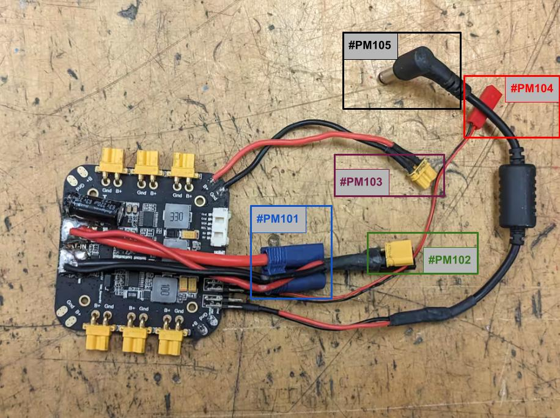
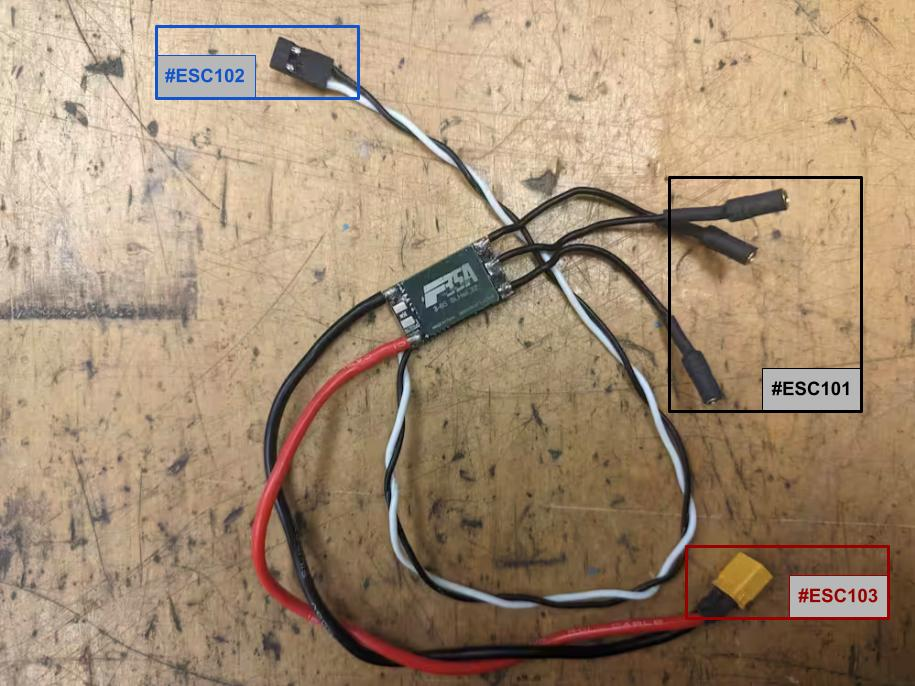

# Component Preparation Guide

Some components require modifications before assembling. This guide covers adjustments needed for the power module, brushless motors, and ESCs.

---

## Part 1: Power Module Modification

The Power Module distributes power to all components (computer, motors, arm, flight controller) and monitors battery status via Pixhawk.

### Materials

All the materials for this section are listed in [components list -> Power Module modification](0_components_list.md#power-module-modification).

Also it will be necessary some heat shrink tubing (small and big), solder tin and a jumper.

### Tools

For this section it will be necessary the following tools:
- Solder station.
- Pliers.
- Diagonal pliers.
- Flat-head screwdriver.
- Hammer.
- Bench vise.
- Crimping tools.

### Steps

#### 1. Battery cable and capacitor modification.
 

> Left: Original XT60 configuration and capacitor pointing outwards | Right: Modified EC5 connector and capacitor pointing inwards

1. **Unsolder** the capacitor and battery cable (`#PM2`) from the power board (`#PM1`). Use a thick soldering tip to heat the solder.
2. **Remove** the original XT60 connector from the battery cable (`#PM2`). To do this, do not cut the wire. Break the connector using a pair of diagonal pliers, a flat-head screwdriver, and a hammer. Finally, desolder the wires from the original terminals. If the terminals have a side hole, this is very useful for heating the internal solder tin by inserting a small soldering tip.
3. **Solder** the new EC5 connector (`#PM3`). First, fill a terminal with solder tin using the side hole to heat the solder tin from the inside. Then insert a wire into the terminal and solder it making sure the wire and terminal are as well aligned as possible. Repeat this process with the other wire.
Once both wires are soldered, slide the EC5 connector housing from the cable side (without terminals) until it reaches the terminals. Hold the connector with a bench vise and finish inserting the terminals using a screwdriver and a hammer.
4. **Resolder** the capacitor and battery cable so they point **inward** on the power board (`#PM1`).

---
#### 2. Hot-swap cable assembly.
 

 
> Left: Pre-sealed assembly showing diode and XT30-M connections | Right: Finished cable with insulated joints

5. **Insert** XT30-M connector (`#PM4`) in the XT30-F connector (`#PM8`) to keep its terminals in place when soldering.
6. **Bend** the diode's (`#PM5`) anode (right leg) to connect with the positive terminal of the XT30-M connector (`#PM4`) and **solder** it.
7. **Solder** the diode's cathode (left leg) to the red (positive) power cable (`#PM6`).
8. **Solder** the black (negative) power cable (`#PM7`) to the negative terminal of the XT30-M connector (`#PM4`).
9. **Add** heat shrink tubing over the connectors and **heat** to seal.  
   > :information_source: This becomes the **hot-swap cable** - compare your result with the above right image .
10. **Solder** the hot-swap cable to the battery cable pads keeping the same orientation (pointing inwards). See [final picture](1_component_preparation.md#modified-power-module) as reference.

---
#### 3. Microdriver cable assembly.
 

> Left: Preparation stage | Right: Finished assembly  

11. **Insert** XT30-M connector (`#PM4`) in the XT30-F connector (`#PM8`) to keep its terminals in place when soldering.
12. **Solder** both power cables to XT30-F connector (`#PM8`):
   - Red (`#PM6`) → Positive terminal
   - Black (`#PM7`) → Negative terminal

13. **Add** heat shrink tubing to **seal** connections.  
    > :information_source: Now referred to as **microdriver cable** - compare with the above right image.
14. **Solder** microdriver cable to the power board (`#PM1`)):
   - Red (`#PM6`) → B+ pad
   - Black (`#PM7`) → GND pad  

---
#### 4. Masterboard cable assembly.

> **Top view: Components for masterboard cable (from right to left: masterboard power cable, JST male connector, JST female connector)**

15. **Cut** the masterboard power cable (`#PM10`) in half.
16. **Crimp** JST connector (`#PM11`)(`#PM12`) onto each cable.
    > ⚠️  Be sure to orient the connector correctly to ensure positive-to-positive wire alignment.

    > :information_source: Now referred to as **masterboard cable**.
17. **Save** the connector-bearing cable for the [flying arm assembly](6_flying_arm_assembly.md).
18. **Slide** heat shrink tubing to the remaining masterboard cable. **Solder** it to the **5V com pin** of the power board (`#PM1`), ensuring proper polarity (black cable to ground, green/red cable to 5V). **Heat** the shrink tube to **seal** connections.

---
#### 5. Computer cable modification

> **Close view: VDD jumper pins (middle left) and computer cable at servo pin (lower right)**

19. **Set VDD to 12V** using the jumper configuration of the power board (`#PM1`).
20. **Cut** the computer cable (`#PM9`) to a **24cm length**.
21. **Slide** heat shrink tubing onto the computer cable. **Solder** it to the **VDD servo pin**, maintaining correct polarity. **Heat** the shrink tube to **seal** connections.

---
#### Modified power module.
In the following image the final power module is shown with the reference ids of the output connections.

| ID       | Part Name             |
|----------|-----------------------|
| `#PM101` | Battery cable         |
| `#PM102` | Hot-swap cable        |
| `#PM103` | Microdriver cable     |
| `#PM104` | Masterboard cable     |
| `#PM105` | Computer cable        |

---

## Part 2: Brushless Motor and ESC Modification

In this part you’ll modify both the brushless motors and the ESCs. Follow the steps closely to ensure proper electrical connections and maintain correct polarity.

### Materials
All the materials for this section are listed in [components list -> Brushless Motor and ESC Modification](0_components_list.md#brushless-motor-and-esc-modification).

Also it will be necessary some heat shrink tubing (medium) and solder.

### Tools

For this section it will be necessary the following tools:
- Solder station.
- Pliers.
- Diagonal pliers.
- Crimping tools.

### Steps

#### Brushless Motor Modification

> Left: Preparation stage | Right: Finished assembly

1. **Trim** the phase cables (`#ESC1`) by about **5cm**.  
   > ⚠️  Save the trimmed segments for the ESC modification.
2. **Solder** the male banana plugs (`#ESC2`) to the phase cables connected to the motors (`#ESC1`). First, fill the banana plug with solder tin using the side hole to heat the solder tin from the inside. Then insert a phase cable into the terminal and solder it making sure that is centered and that is as well aligned as possible with the banana plug.
3. **Add** heat shrink tubing around the banana plug to insulate the soldered joints.
4. **Repeat** these steps for all 18 phase cables connected to the brushless motors.

---

#### ESC Modification

> Left: ESC close view | Middle: ESC servo connector orientation | Right: Final result

5. **Trim** 5cm of the 18 leftover phase cables.
6. **Solder** the 18 female banana plugs (`#ESC3`) to the them following the instructions described in step 2.
7. **Add** heat shrink tubing over the connections to **seal** them.
8. **Use** the XT30-F connector (`#ESC5`) to keep in place the terminals of the XT30-M (`#ESC4`) during the soldering.
9. **Solder** the 6 XT30-M (`#ESC4`) connectors to the ends of the power cables:
   - Red (`#ESC6`) → Positive terminal
   - Black (`#ESC7`) → Negative terminal
10. **Slide** heat shrink tubing onto each power cables and **heat** it to **seal** the terminals.
11. **Crimp** (`#ESC11`) the 12 servo cables to the 6 servo connectors (`#ESC10`) as shown in the previous image:  
   - White (`#ESC8`) to the left one.
   - Black (`#ESC9`) to the right one.
   - leave the middle one unconnected.
12. **Solder** Power cables to the ESC’s (`#ESC12`) power pads.  
    > ⚠️  Try to solder them parallel to the ESC and without too much solder tin to ensure that fits in its case.

    > :information_source: Connect the red cable (`#ESC6`) to the ESC's positive (`+`) pad and the black cable (`#ESC7`) to the ESC's negative (`–`) pad.
13. **Solder** the servo cables to the ESC’s (`#ESC12`) servo pads.  
    > ⚠️  Try to solder them parallel to the ESC and without too much solder tin to ensure that fits in its case.

    > :information_source: Attach the white cable (`#ESC8`) to the signal (`S`) pad and the black cable (`#ESC9`) to the ground (`–`) pad.
14. **Solder** the phase cables to the ESC’s (`#ESC12`) phase pads.
    > ⚠️  Try to solder them parallel to the ESC and without too much solder tin to ensure that fits in its case.

---

Here is the table with the reference of each output labels:
| ID        | Part Name             |
|-----------|-----------------------|
| `#ESC101` | ESC phase cables      |
| `#ESC102` | ESC servo cables      |
| `#ESC103` | ESC power cables      |

---
| [Top of page](#component-preparation-guide) | [Back to Hardware Building Instructions](README.md) | [Back to Borinot HOME](../README.md) | [Next → Airframe Assembly](2_airframe_assembly.md) |
| --- | --- | --- | --- |
