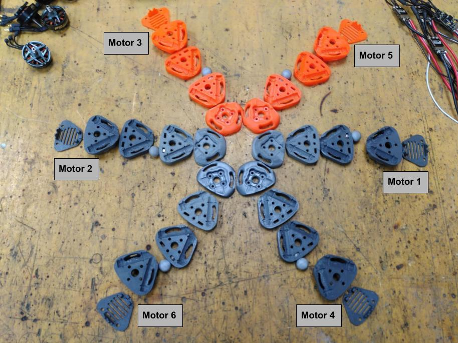
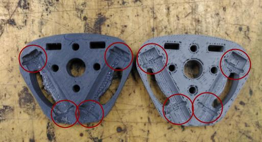
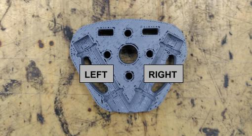

# Airframe Assembly Guide

The airframe is the structure that houses and maintains the motors in their respective positions. This guide covers the assembly procedure for the airframe.

## Materials

All the materials for this section are listed in [components list -> Airframe Assembly](0_components_list.md#airframe-assembly).

### Tools

For this section it will be necessary the following tools:
- Cutting Pliers.
- Pliers.
- Allen key.
- Solder station.
- Ball of paper.

---

## Part 1: Motor Holder Preparation

The Motor holder holds both the motor and the carbon fiber tubes together. It also houses the ESC and the Optitrack markers.

### Motor holders parts

In [components list -> Motor holder parts](0_components_list.md#motor-holder-parts) the 3D parts are listed.

### Steps

#### 1. Parts preparation.

1. **Clean** all Motor holder parts (`#AF1`) following [general cleaning tips](./cad_files/README.md#general-cleaning-tips).
2. **Install** two inserts (`#AF5`)) on the motor holder bottom part (`#MH1`). Place them vertical on top of each hole and with the flat side on top.
With a solder tip do a vertical slightly pressure until it is inside the hole

> Motor holder bottom part before and after inserts

3. **Glue** the auxiliar parts (`#MH6`)(`#MH7`)(`#MH8`)(`#MH9`) composing the cover (`#MH5`) as shown in the image below.

> Cover before and after assembling its auxiliar parts.

4. **Repeat** these steps for all 6 Motor Cases.

5. **Remove** the head of all nylon screws (`#AF3`) creating a 10 mm nylon screw without head.
---
#### 2. Markers assembly and motor distribution.
At the end of this chapter all motor holders parts must be sorted and distributed as it final distribution as shown in the image above.

> Motor holder parts with a motor ID assigned, distributed as Hexarotor X airframe reference and sorted to easily stack each set of parts.

6. Take each set of motor holders and **assign a motor ID** following [Hexarotor X airframe reference](https://docs.px4.io/main/en/airframes/airframe_reference.html#hexarotor-x) ID. Use **orange** ones for the **front motors**. Distribute each motor holder set using the same reference.

7. **Sort** motor holders parts. It's important to note that the faces of the middle parts (`#MH2`)(`#MH3`) are not symmetric. In the following image the difference between faces is shown. Sort parts from bottom to top taking into account that differences and making them fit together.

> Differences between middle parts faces.

---

9. **Assemble** the Marker (`#AF2`) with the M4 nut (`#AF4`) and the M4 nylon screws without head (`#AF3`) using the following table as reference. 

| Motor ID | Marker Position |
|:--------:|-----------------|
| 1        | Bottom Right    |
| 2        | Top Right       |
| 3        | Top Left        |
| 4        | Bottom Left     |
| 5        | Top Right       |
| 6        | Bottom Right    | 

The following images show marker position references and the process of assembling the marker. Pliers may be helpful to screw the Nylon screw.

> **Left:** Marker position reference | **Middle:** Components before assembling | **Right:** Result

---

## Part 2: Frame Assembly

The frame is composed of two intersecting triangles. Each motor holder is a vertex and each carbon fiber tube an edge.
The assembly process is the following:
1. Assemble one triangle (motor 5, 4 and 2).
2. Assemble two motors of the second triangle (motors 3 and 1).
3. Merge both triangles.
4. Assemble the last motor (6).

> **Left:** First triangle assembled | **Middle:** Both triangles merged | **Right:** Ariframe assembled

### Steps

#### 1. Prepare Carbon Tubes
1. For each carbon tube (`#AF7`), slide on two O-rings (`#AF8`) on both ends.

---

#### 2. Assembly motor holders with carbon tubes.
The process of assembling a motor holder is to stack each part. When a motor holder set is stacked, there are 3 levels of carbon tube holders. Use the following table and image as reference to know where to insert the carbon tubes:

| Motor ID | Left Position | Right Position |
|:--------:|---------------|----------------|
| 1        | Middle        | Top            |
| 2        | Middle        | Top            |
| 3        | Top           | Bottom         |
| 4        | Top           | Bottom         |
| 5        | Bottom        | Middle         |
| 6        | Bottom        | Middle         |

> Left and right position reference

2. **Select** a motor. Take its bottom part (`#MH1`) and **insert** four M3x30mm (`#AF6`) screws on it. Use something (for example a ball of paper) to keep the screws in position.

> Example of how to keep screws in place.

3. **Stack** each motor holder part inserting a carbon tube between parts when necessary according to the **table above**.

4. **Place** a motor (`#AF9`) on top of the stack. Make sure to place the motor so it does not cover the marker. While keeping pressure, turn the stack upside down and screw in the motor.

5. **Repeat** steps for all the motors.

---

## Part 3: Install ESC

With the frame assembled, install the ESCs and connect them to the motors.

### Steps

1. **Install ESCs:** Position the ESC (`#AF10`) within the bottom section of each Motor Holder (`#MH1`). First insert the power side, then the phase side. Use the following image as a reference.

> ESC installed

---
2. **Mount Covers:** Attach the cover (`#MH5`) onto each Motor Holder using 2 M3x6mm screws (`#AF11`).
3. **Connect ESC to motors:** Connect the phase cables to the closest ones.
4. **Repeat:** Complete these steps for all 6 Motor Cases.

---

| [Top of page](#airframe-assembly-guide) | [Back to Hardware Building Instructions](README.md) | [Back to Borinot HOME](../README.md) | [Next -> go to Main Body Assembly](./3_main_body_assembly.md)
| --- | --- | --- | --- |
