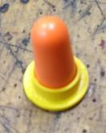
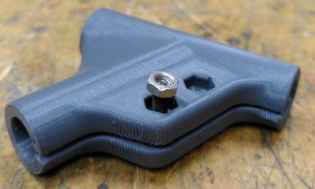
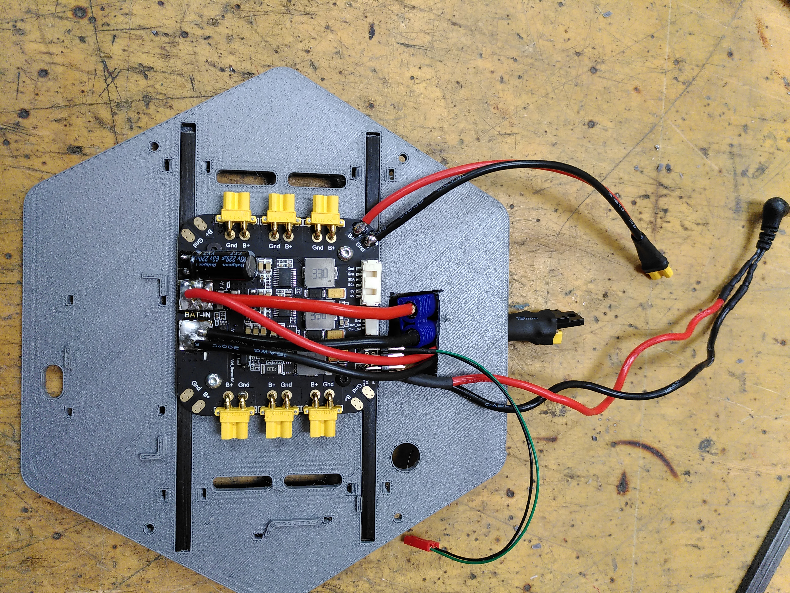
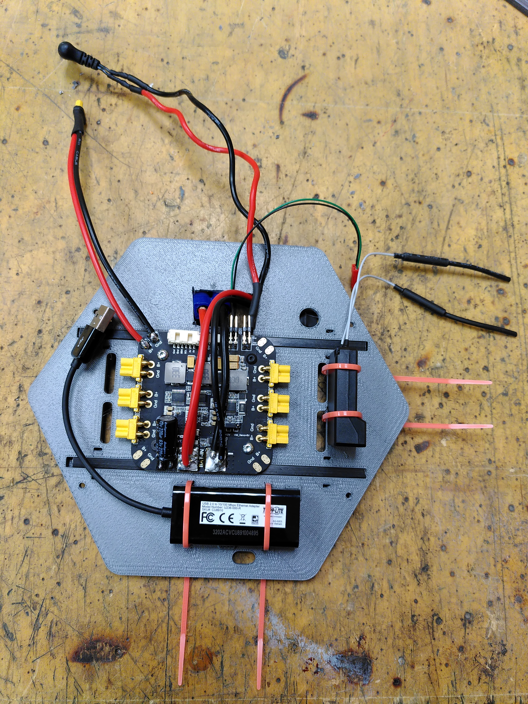
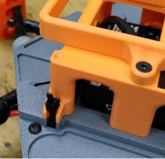
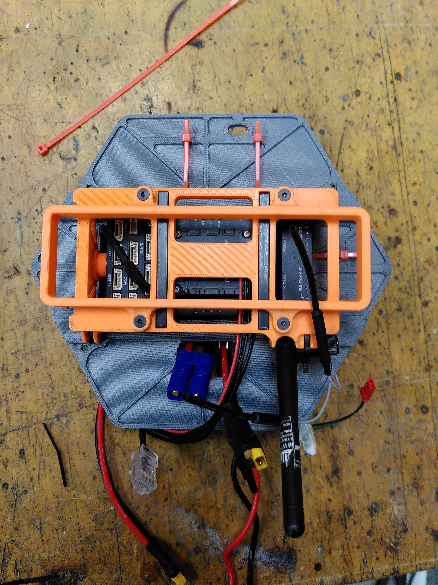
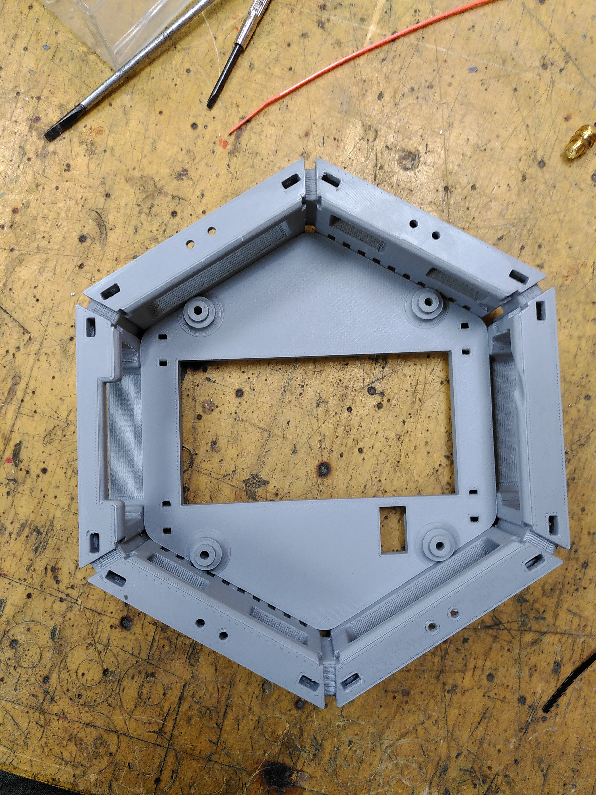
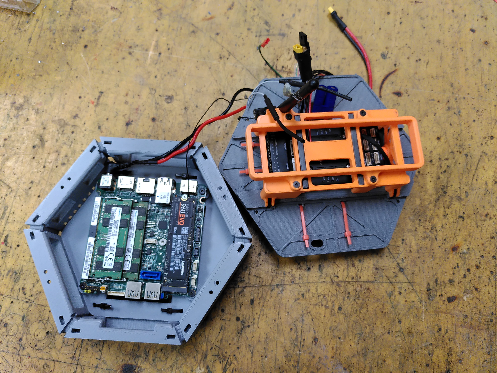

# Borinot: Upper Body Assembly Guide

The Upper Body of Borinot acts as a flying platform, similar to a hexacopter. It consists of the main body which accommodates core electronics like the onboard NUC computer, the Pixhawk flight controller, and the power module, as well as the airframe that ensures the stable positioning of the motors. The Upper Body can operate as a standalone hexacopter or be integrated into the Lower Body for expanded functionalities.

---

## Materials

All the materials for this section are listed in [components list -> Upper body Assembly](0_components_list.md#upper-body-assembly).

## Tools

For this section it will be necessary the following tools:
- Cutting Pliers.
- Pliers.
- Allen key.
- Solder station.
- Scissors.
- Glue.
- Flathead screwdriver.
- Hammer.

## How to cut carbon fiber tubes
1. Put on working gloves, a face mask and protective glasses.
2. Use a bench wise to fix the carbon tube.
3. Cut it with the dremel.

---

## Assembly

### Prerequisite: Component Preparations

Before starting the assembly of the upper body, ensure that the power module (`#UB13`) has been modified following the [Power Module Modification Guide](power_module.md).

---
### Part 1: Main Body Case Preparation

1. **Clean** all 3D printed parts (`#UB1`)(`#UB6`)(`#UB8`)(`#UB9`)(`#UB24`) following [general cleaning tips](./cad_files/README.md#general-cleaning-tips).
2. **Insert** 4 M3 nuts (`#UB2`) in the pixhawk case (`#UB1`). A flatheaded screwdriver and a hammer may be useful.
3. **Create** the dampers: Insert a earplug (`#UB3`) in the earplug tool (`#UB4`). Cut the earplug at that height. Use the following image as reference:

---
4. **Glue** 6 dampers in the pixhwak case (`#UB1`).

> Pixhawk case with dampers and nuts.

---
5. **Insert** the two 65mm squared carbon fiber tubes (`#UB5`) in the pixhawk case (`#UB1`).
6. **Attach** the battery support (`#UB6`) to the pixhawk case (`#UB1`) using 4 M3x10mm screws (`#UB7`).

>Pixhawk case and battery support assembled.

---
7. **Insert** 4 M3 nuts (`#UB2`) in the main body case top part (`#UB8`). To facilitate the process, insert an M3 screw bigger than necessary then screw the M3 nut until it fits in its hole. Tighten the screw until the nut is in its slot, then loosen the screw. Use the following image as reference (The 3D printed part is different):

> Insert nut tip visual explanation.

8. **Glue** 4 dampers to main body case top part (`#UB8`).

> Main boddy case uppert part with dampers and nuts.

9. **Insert** two 150 mm squared carbon fiber tubes (`#UB10`) in the main body case top part (`#UB8`). Fix them with 4 fasteners (`#UB11`).
---

10. **Insert** the last 4 M3 nuts (`#UB2`) in the main body bottom part (`#UB9`). Remember the tip explained in step 7.
11. **Insert** two 150 mm squared carbon fiber tubes (`#UB10`) in the main body case bottom part (`#UB9`). Fix them with 4 fasteners (`#UB11`).

---

### Part 2: Main Body Assembly

The main body requires careful placement and connection of components:

12. **Disconnect** Wi-Fi antenna (`#UB12`) from the Nuc (`#UB22`). Attach it to the pixhawk case (`#UB1`) using a fastener (`#UB11`).
13. **Attach** modified power module (`#UB13`) to the main body case upper part (`#UB8`). First insert the battery connector (the blue one) and the hot swap connector (the one with the diode). Use 4 M3x6mm screws (`#UB14`). 

> Power module assembled.

---
14. **Secure** radio receiver (`#UB16`) to the main body case upper part (`#UB8`) using fasteners (`#UB11`). **Don't thigth them**.
15. **Secure** ethernet adapter (`#UB15`) to the main body case upper part (`#UB8`) using fasteners (`#UB11`). 

> Ethernet adapter and radio receiver secured.

---

16. **Insert** pixhwak ethernet cable (`#UB20`) trough its designated hole of the main body case upper part (`#UB8`). Connect it to the Pixhwak 5x (`#UB19`) designated port.
17. **Connect** pixhawk power cable (`#UB21`) to pixhwak 5x (`#UB19`). Pass it trough its designated hole of the main body case upper part (`#UB8`).
18. **Connect** radio data cable (`#UB17`) to the pixhawk (`#UB19`) and the radio receiver (`#UB16`) passing it trough its designated hole of the main body case upper part (`#UB8`).
19. **Guide** the antenna cable (`#UB12`) by its designated hole of the main body case upper part (`#UB8`).
20. **Place** the Pixhawk 5x (`#UB19`) inside its designated case (`#UB1`).
21. **Secure** pixhawk case (`#UB1`) to the main body case upper part (`#UB8`) using fasteners (`#UB11`). Fastener heads must be outside main body case.

> **Left:** Pixhawk case fasteners detail. | **Right:** Pixhawk case assembled.

---

22. **Connect** the computer power cable(`#UB13`) to the NUC(`#UB22`).
23. **Connect** The Wi-Fi antenna(`#UB12`) to the NUC(`#UB22`).
24. **Insert** nuts for the optitrack makers.
25. **Place** insertions in the middle part
24. **Install** main body middle part(`#UB24`) in main body bottom part(`#UB9`) as shown in the following image:

25. **Insert** two 150 mm squared carbon fiber tubes (`#UB10`) in the main body case bottom part (`#UB9`) using the lateral hole. Push them to the end. Fix them with 4 fasteners (`#UB11`).
26. **Fasten** lower part.

---
- **Connect the NUC to the power module using the designated computer cable.**
- **Connect the NUC to the Wi-Fi antenna.**
- **Position the bottom part of the main body inside the contour part.**
- **Insert the 150mm square carbon fiber tubes into the top and bottom parts of the main body case.**

- **Place the NUC inside the main body case and secure it to the bottom part using 4 M3 16mm screws.**
- **Connect all necessary cables**:
  - **Pixhawk 5x Ethernet to the NUC.**
  - **Pixhawk 5x power to the power module.**
  - **Pixhawk 5x USB to the NUC using the provided USB C cable.**

Ensure all connections are secure before proceeding with the next step.

---

| [Top of page](#main-body-assembly-guide) | [Back to Hardware Building Instructions](README.md) | [Back to Borinot HOME](../README.md) | [Next → Upper Body Integration](4_upper_body_integration.md) |
| --- | --- | --- | --- |
