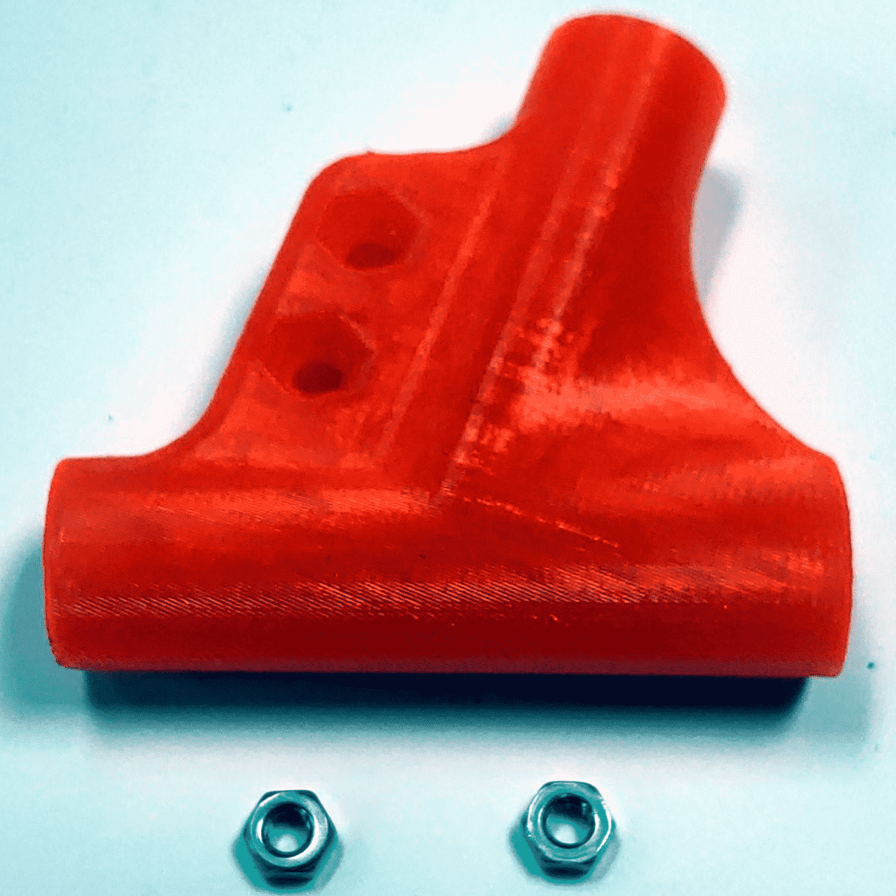
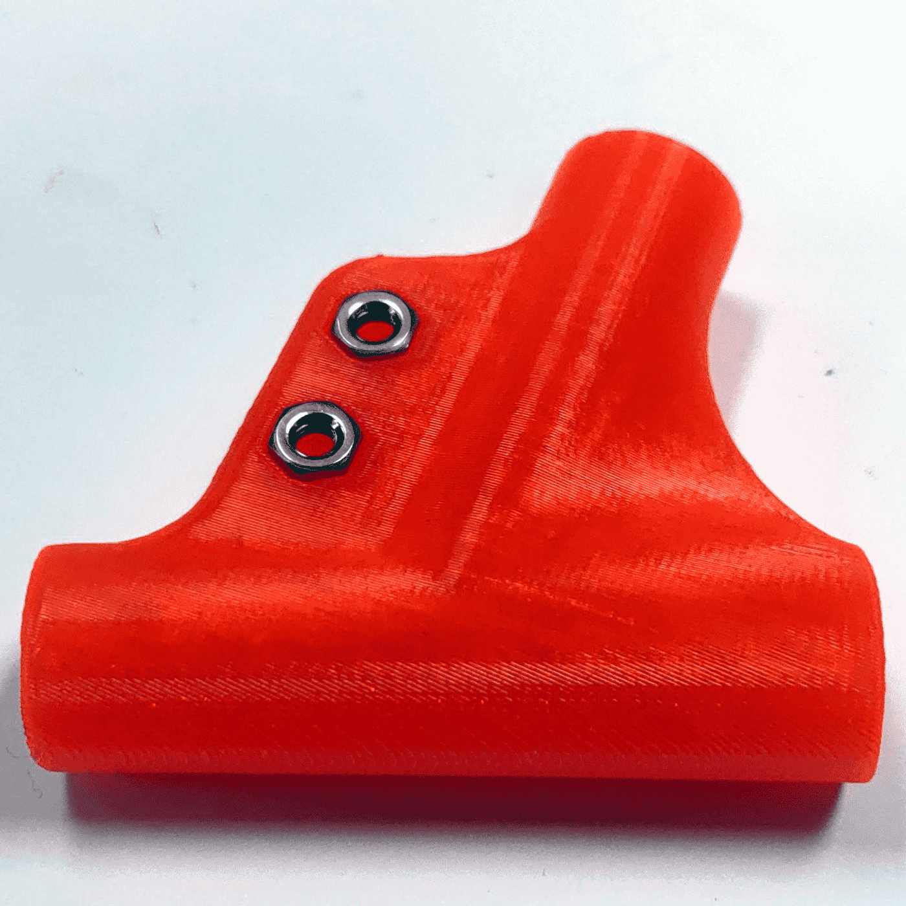
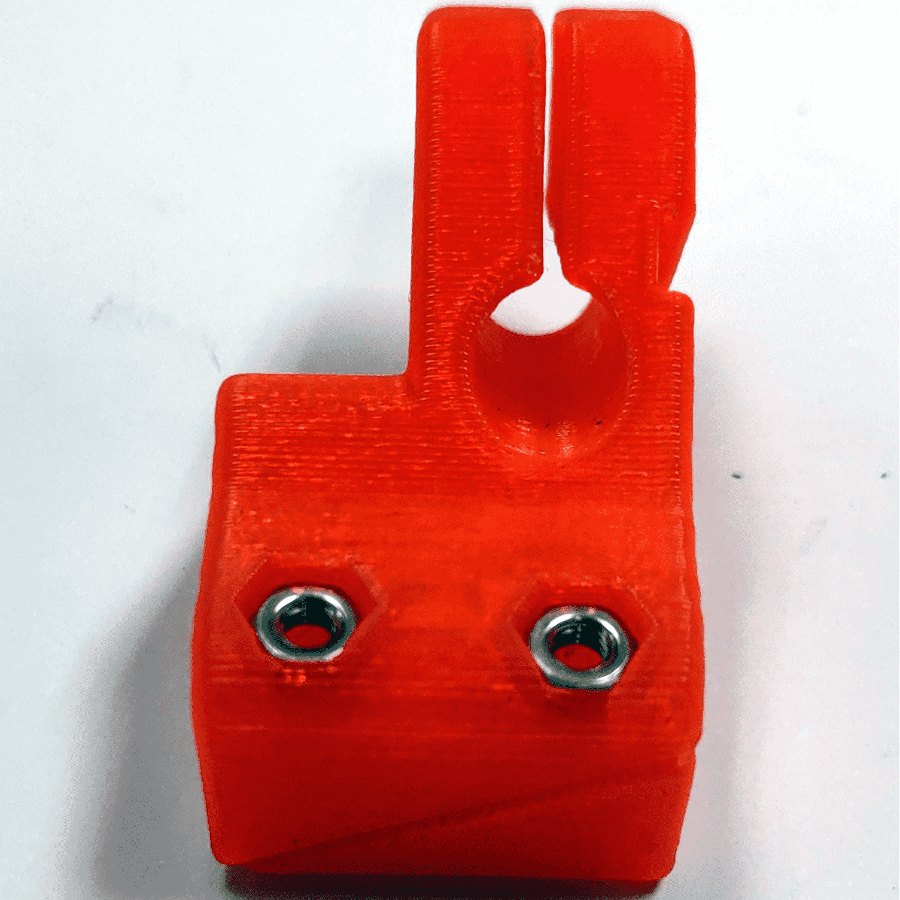
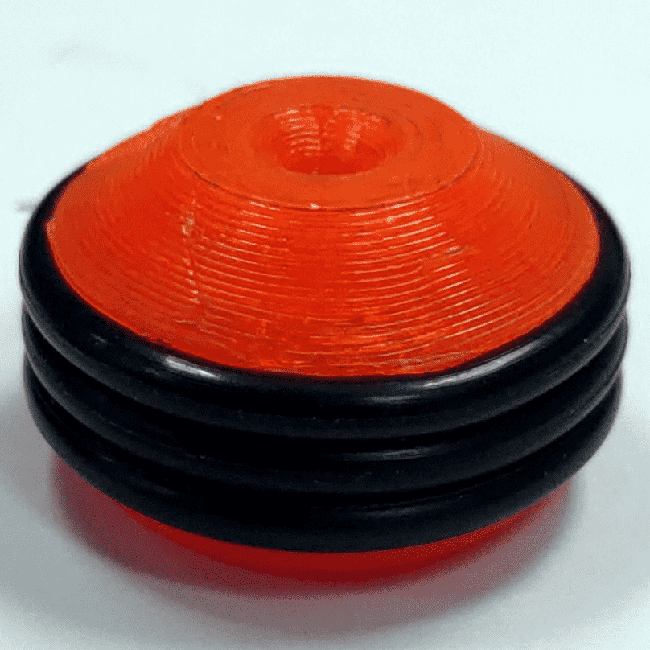
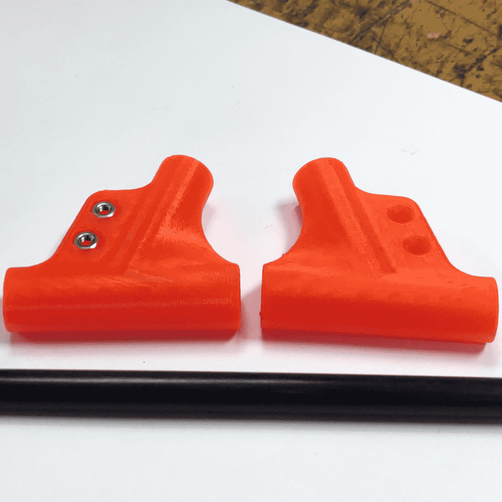

# Borinot: Landing Gear Assembly Guide

<!-- Need picture of the assembled landing gear, maybe from above-->

> *Assembled Landing Gaer, [**weight**] g*
<!-- Fill in the weight -->

The landing gear serves as the foundational structure for Borinot's lower body, ensuring safe and stable landings. It comprises support tubes, connectors, and rubber seals. This guide outlines the detailed assembly process for the landing gear.

---

## Components List

| Part Name | Qty. | Description | Reference |
|---|:---:|---|---|
| [3D Kit](CAD/legs/) | 1 | Landing Gear | [Link](CAD/legs/) |
| Ø20mm O-Ring Seals | 12 | Rubber seals | - |
| M3x10mm Screws | 8 | - | - |
| M3x16mm Screws | 8 | - | - |
| M3 Nuts | 16 | - | - |
| Ø8x6x110mm CF Tubes | 4 | Carbon tubes | - |
| Ø8x6x170mm CF Tubes | 2 | Carbon tubes | - |
| Ø8x6x300mm CF Tubes | 2 | Main support tubes | - |

## Assembly/Modification Guide

### Part 1: 3D Kit Preparation

- **Clean all components of the Landing Gear - 3D Kit ensuring that the tube entry points are devoid of any obstructions**.

- **Insert M3 Nuts into the designated slots**.

- **Position 3 Ø20mm O-Ring Seals around each pawn for cushioning**.

### Part 2: Assembly

- **Connect the wye connectors to the pawns using the 300mm carbon fiber tubes. Ensure alignment as shown in the reference images. Repeat for the second set**.

- **Join the cross-block connectors using the 170mm carbon fiber tubes, ensuring alignment with provided images. Create two such assemblies**.

- **Assemble the entire landing gear by integrating the previously made assemblies with the 4 110mm carbon fiber tubes. Follow the reference images for accurate alignment**.

---

[Next → Flying Arm Assembly](6_flying_arm_assembly.md)