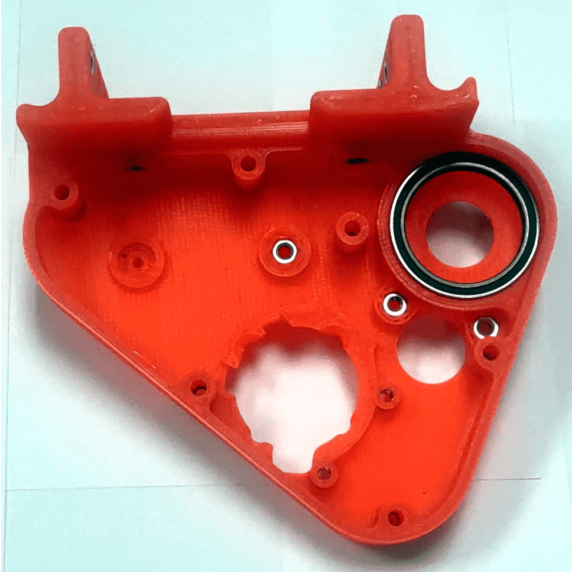
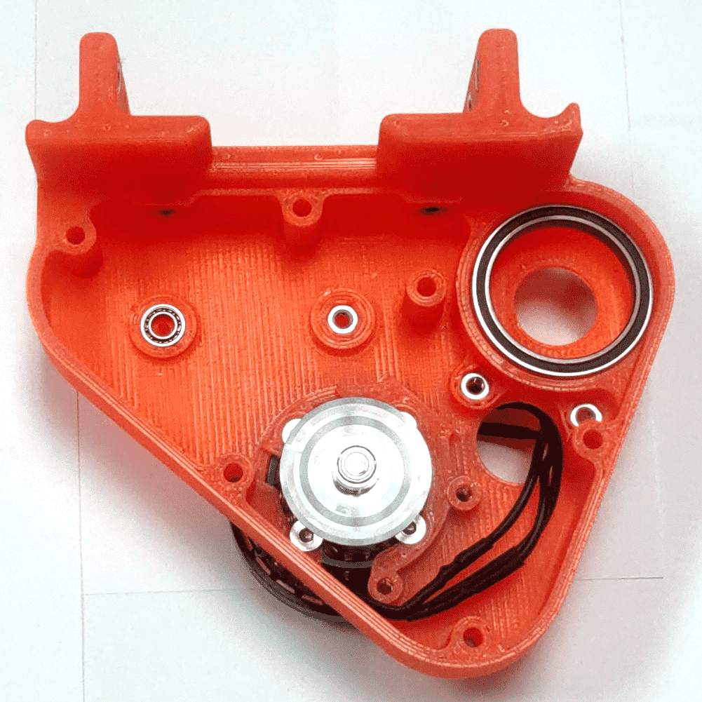
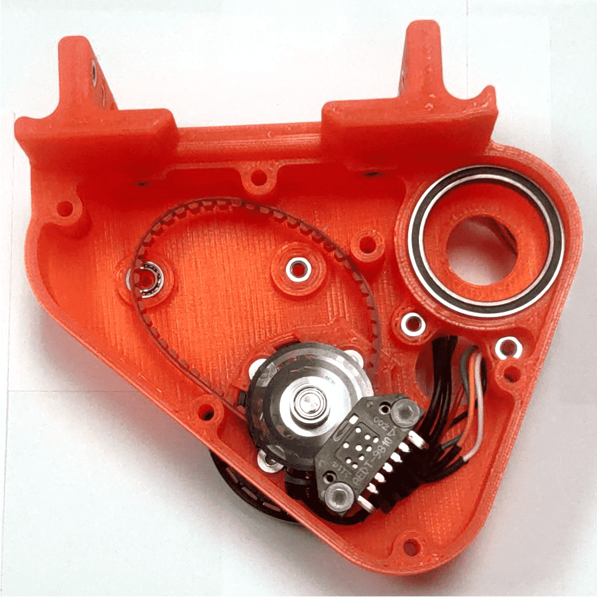
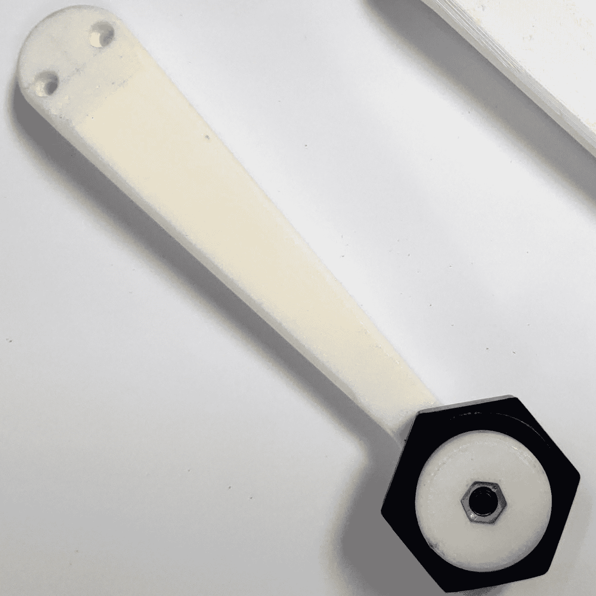

# Borinot: Flying Arm Assembly Guide

> *Assembled Flying Arm, [**weight**] g*
<!-- Fill in the weight -->

The flying arm is a critical component of Borinot, responsible for the robot's diverse range of movements and functionalities. It serves multiple roles: as a tail for aerial locomotion, a hand for agile aerial manipulation, and even as a leg for hybrid aerial-contact locomotion. Comprising two links and an extremity, this guide will walk you through the assembly process.
> **Note**: Both links are based on the actuator module from the [Open Dynamic Robot Initiative (ODRI)](https://github.com/open-dynamic-robot-initiative/open_robot_actuator_hardware/blob/master/mechanics/actuator_module_v1/actuator_module_v1.1.md). Refer to their project for additional information.

---

## Components List

| Part Name | Quantity | Description | Reference |
|---|:---:|---|---|
| Extremity - 3D Kit | 1 | 3D printed component for extremity | [Link to the part](CAD/limbs/) |
| Flying link - 3D Kit | 1 | 3D printed link component | [Link to the part](CAD/limb/) |
| Off-the-shelf Components | 2 | Components used within the links | [ODRI Actuator Components](https://github.com/open-dynamic-robot-initiative/open_robot_actuator_hardware/blob/master/mechanics/actuator_module_v1/actuator_module_v1.1.md#off-the-shelf-components) |
| M3x5mm Flat Head Screws | 7 | - | - |
| M3x15mm Screw | 4 | - | - |
| M3x16mm Flat Head Nylon Screw | 2 | - | - |
| M3x20mm Flat Head Screws | 6 | - | - |
| M3 Nuts | 18 | - | - |
| M3 Inserts | 5 | - | - |

## Assembly

### Prerequisite: ODRI Actuator Module and Motor & Encoder Preparation

As previously mentioned, the flying arm consists of two links: The base link, which is a variant of the actuator module, and the first link, which mirrors the [ODRI Actuator Module V1.1](https://github.com/open-dynamic-robot-initiative/open_robot_actuator_hardware/blob/master/mechanics/actuator_module_v1/actuator_module_v1.1.md#off-the-shelf-components). Begin by assembling a complete actuator module based on the ODRI guide, and then prepare the components for the base link.

### Part 1: Base Link's Shell Preparation

Prepare the base link's shell to accommodate the components you've prepared (the motor and encoder).

- **Thoroughly clean the Flying - 3D Kit components**.
- **Insert the M3 Nuts, M3 Inserts, Output Bearings, and Transmission Bearings into their respective slots in the 3D kit components**.

### Part 2: Base Link Assembly

The base link shares components with the actuator module, so the assembly process is quite similar.

- **Secure the motor within Shell A using 4 screws**.
- **Position the 150mm timing belt around the motor's axle**.
- **Secure the encoder next to the motor using nylon screws**.
- **Align the ODRI 3D component with the 201mm timing belt and close using the Flying Case B secured with 6x20mm screws**.

### Part 3: Link Attach

With both the base and first link assembled, the final step involves connecting them with the extremity.

- **Route the first link's cable through the base link**.
- **Attach the first link and the base link using 2 M3 15mm screws**.

- **Attach the ODRI link and the extremity using 2 M3 15mm screws**.

<!-- Add section for the extremities -->

---

[Next → Lower Body Integration](7_lower_body_integration.md)