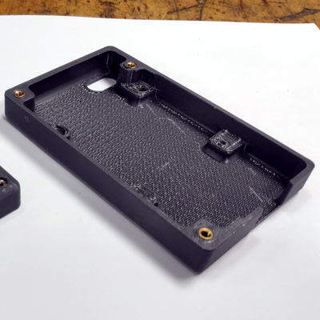
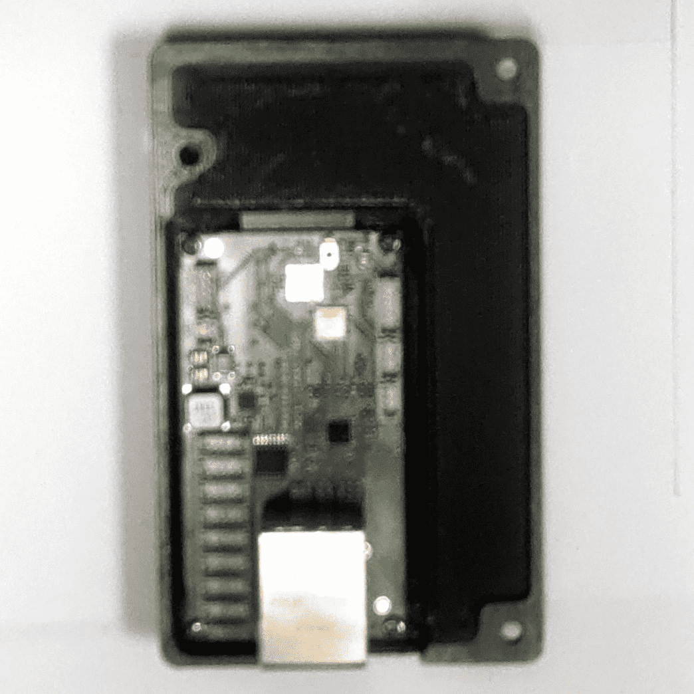

# Borinot: Lower Body Assembly Guide

The lower body is an important part of borinot. It's contains the arm and the associated low level controller and the landing gear. This part can be assembled to Borinot to give him access to an arm.

## Components List

| Part Name | Quantity | Description | Reference |
|---|:---:|---|---|
| [Controller Case - 3D Kit](CAD/platform/) | 1 | - | [Link to the part](CAD/platform/) |
| Master Board | 1 | - | - |
| Micro Driver | 1 | - | - |
| M2 Nuts | 4 | - | - |
| M2.5 Nuts | 4 | - | - |
| M2x6mm Screws | 4 | - | - |
| M2.5x6mm Screws | 4 | - | - |

## Assembly Guide

### Prerequisite: Landing Gear and Flying Arm

The [Landing Gear](landing_gear.md) and the [Flying Arm](flying_arm.md) have they own guide to simplifly the assembly. Please go refer to them if these parts are not yet assembled.

### Part 1: Controller Case

The controller case contains all the electronics require to control the arm. It contains a microcontroller have is connected to the motors and encoders of the arm. It also contain the masterboard, interface between the computer and the microcontroller. Both of these board are powered using the Power module contains in the Upper Body. In order to assemble it properly, we have to first clean the 3D printing and put the nuts and other mechanical components together. After that the boards have to be connected together and finally we can assemble everything.

- **Clean all parts of the Controller Case - 3D Kit**.
- **Insert M2 Nuts, M2.5 Nuts, and M3 Inserts in their designated slots in the 3D kit components**.
- **Connect the two links to the micro driver. Ensure the cable routes through the designated holes in both the controller and flying cases**.

- **Establish a connection between the micro driver and the master board.**
- **Secure the master board inside the controller case - top using M2 screws**.
- **Mount the micro driver at the bottom of the controller case, securing with M2.5 screws**.
- **Close the case using 3 M3 screws**.

### Part 2: Assembly

The controller case and the arm are holded by the landing gear. The last step is to attach the arm to the landing gear.

- **Using 6 M3 screws, attach the arm to the landing gear.**

---

[Next → Final Assembly](8_final_assembly.md)