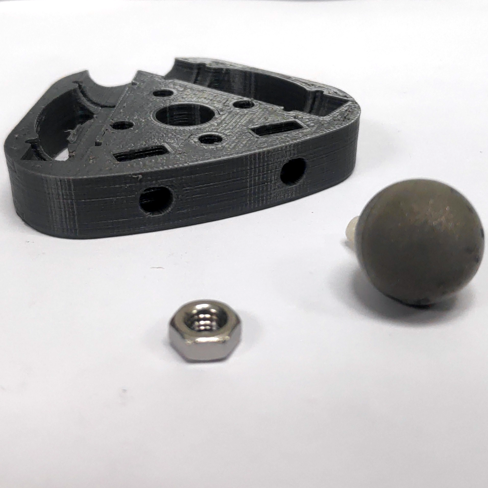
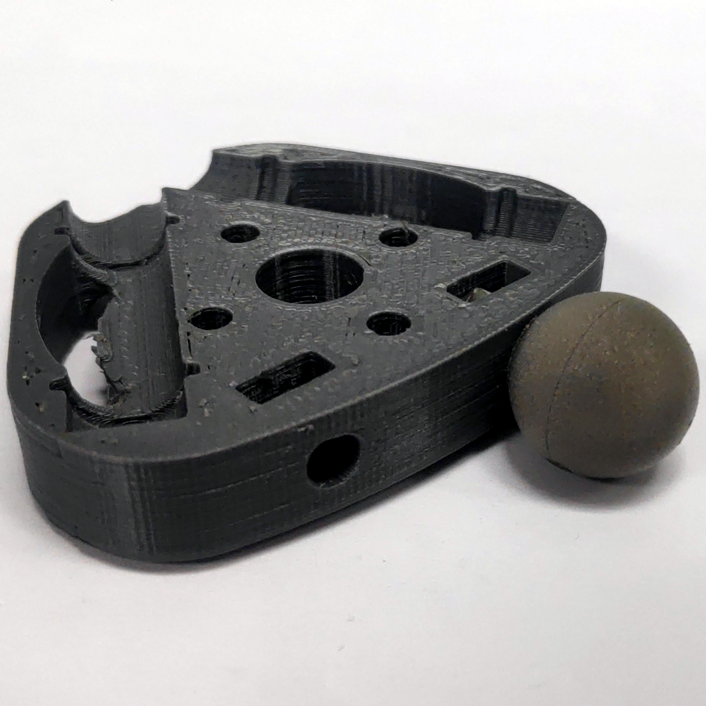
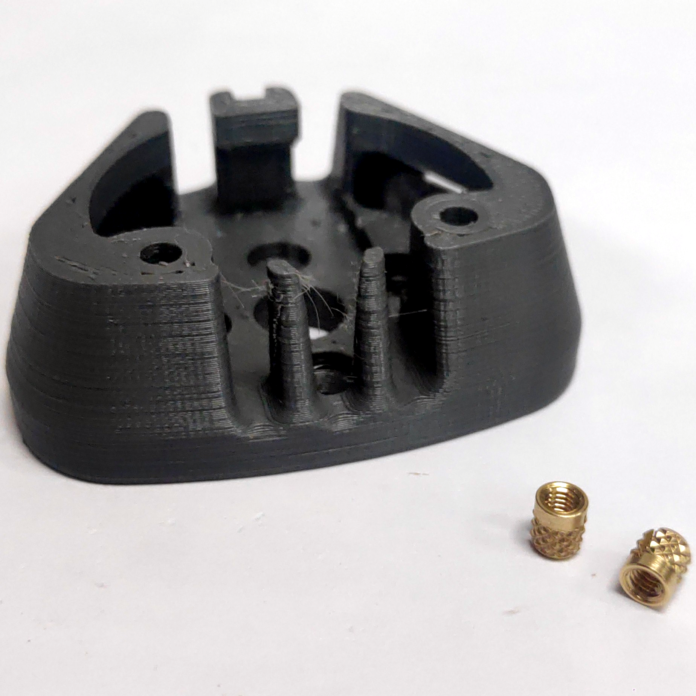
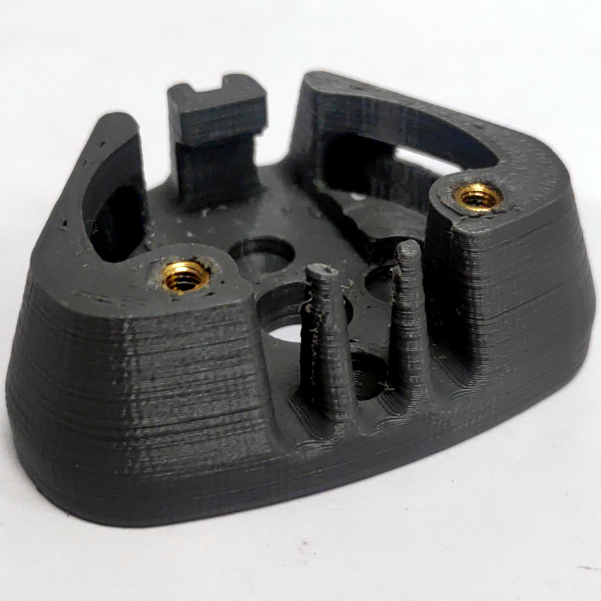
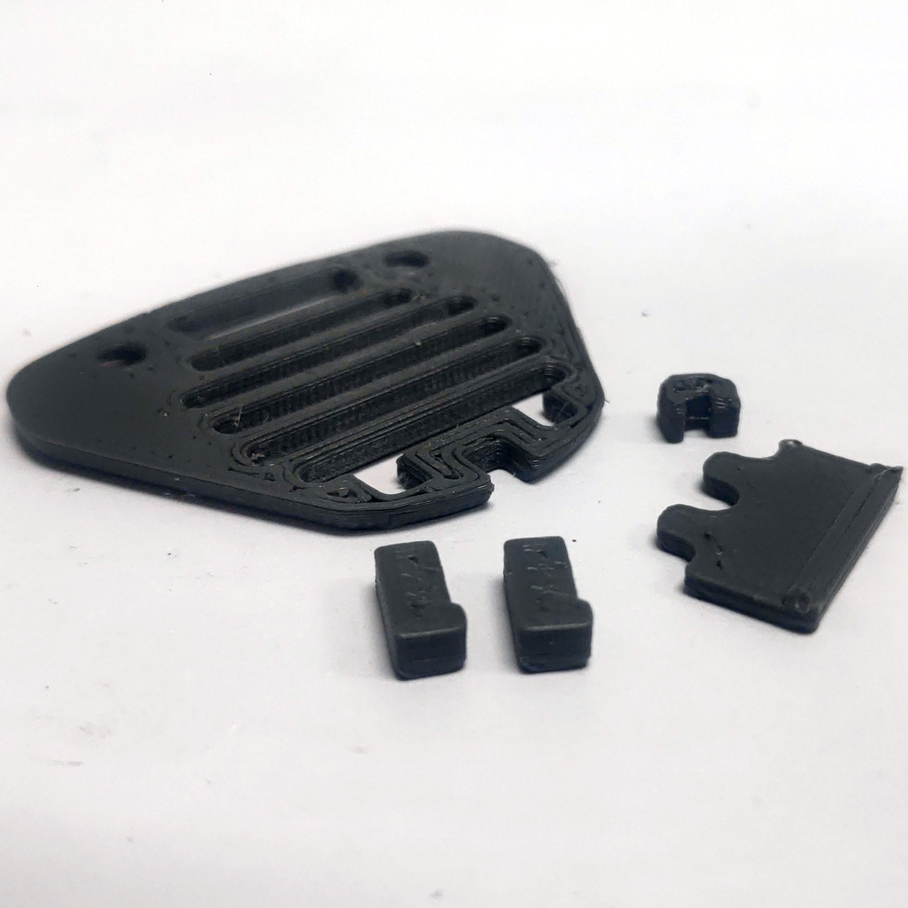

# Borinot: Airframe Assembly Guide

<!-- Need picture of the assembled airframe, maybe from above-->

> *Assembled Airframe, [**weight**] g*
<!-- Fill in the weight -->

The airframe is the structure that houses and maintains the motors in their respective positions. It serves as a foundational structure for Borinot's upper body. The airframe encompasses the motor cases, components that secure the motors to the frame, and the ESCs. This guide outlines the assembly procedure for the airframe.

---

## Components list

| Part Name | Quantity | Description | Reference |
|:-|:-:|:-|:-:|
| Motor Cases | 6 | 3D parts - Motor Holder | [CAD](CAD/platform/) |
| Carbon Fiber Tubes | 6 | ø8mmx352.5mm, Round Checked | [McMaster](https://www.mcmaster.com/products/carbon-fiber-tubing/) |
| O-ring Seals | 24 | ø [**diameter**] mm | [TheORingStore](https://www.theoringstore.com/store/) |
| M4 Marker | 6 | 14 mm M4 | [Optitrack](https://optitrack.com/accessories/markers/#mcm-14.0-m4-10) |
| M4 Nuts | 6 | M4 | [**Insert Proper Link**] |
| M4 Screws | 6 | M4x10mm Nylon | [**Insert Proper Link**] |
| M3 Inserts | 12 | M3 | [**Insert Proper Link**] |
| M3x30mm Screws | 24 | M3x30mm | [**Insert Proper Link**] |
| M3x05mm Screws | 12 | M3x05mm | [**Insert Proper Link**] |
| Motors and ESCs | 6 | Refer to [Brushless Motors & ESCs Modification Guide](brushless_motor_esc.md) | |

<!-- Update links for tubes and o-ring -->

## Assembly

### Prerequisite: Brushless Motors & ESCs Modification

Before assembling the airframe, the brushless motors and ESCs need modifications to be used in the assembly. For detailed steps, follow the [**modification guide**](brushless_motor_esc.md).

### Part 1: Motor Case Preparation

The Motor Case is a structural component that holds both the motor and the carbon fiber tube. It also houses the corresponding ESC and has slots for the Optitrack markers. The Motor Case is composed of multiple 3D printed parts. Clean these components thoroughly before assembling them. From this point forward, each Motor Case is identified using the [Hexarotor X airframe reference](https://docs.px4.io/main/en/airframes/airframe_reference.html#hexarotor-x) ID.

| Motor ID | Marker Position |
|:-:|---|
| 1 | Bottom Right |
| 2 | Top Right |
| 3 | Top Left |
| 4 | Bottom Left |
| 5 | Top Right |
| 6 | Bottom Right |

- **Clean the 3D parts, especially removing any support material inside the tube holder.**
  > :warning: If there are any anomalies in the tube holder, use a drill to eliminate them.

- **For each motor, assemble the marker (M4 nut + M4 nylon screw + M4 marker) ensuring proper placement based on the Motor ID.**
  > :warning: Refer to the table above to determine the marker placement for each Motor Case.

  > :warning: The middle part of the Motor Case is not symmetrical. Test fit with the top and bottom parts to ensure alignment.

- **On the bottom part of the Motor Case, install two inserts.**

- **Assemble the cover to the Motor Case.**
- **Repeat the steps for all 6 Motor Cases.**

### Part 2 : Frame Assembly

Visualize the complete frame as composed of two intersecting triangles, each vertex representing a motor case and each edge representing a carbon fiber tube. Start by assembling one triangle, then, before sealing the last motor case on the final triangle, interlink the two triangles. The triangles are identified by their vertex IDs (triangles 136 and 245). Additionally, add components to the carbon fiber tubes to secure the cables and maintain the frame's stability.

| Motor ID | Left Position | Right Position |
|:-:|---|---|
| 1 | Middle | Top |
| 2 | Middle | Top |
| 3 | Top | Bottom |
| 4 | Top | Bottom |
| 5 | Bottom | Middle |
| 6 | Bottom | Middle |

> :info: **Motor Case assembly instructions**:

- **Combine the top, middle, and bottom parts of the Motor Case.**
- **After positioning the carbon fiber tubes with the O-rings inside the appropriate tube holders of the Motor Case, secure using 4 M3x30mm screws.**
  > :warning: Refer to the above table to determine tube positioning.

  > :warning: Ensure the O-rings fit snugly in their slots.

  > :warning: The motor can be installed in two orientations: with cables on the left or right. Ensure the cables don't obstruct the marker.

- **For each Carbon Fiber tube, slide on two O-rings and a 7cm length of heat shrink tubing on both ends.**

- **Following the Motor Case assembly instructions, put together Motor Cases 1, 3, and 6.**

- **In the same manner, assemble Motor Cases 4 and 5.**
- **Before sealing the final Motor Case (2), merge the two triangles.**
- **Complete the assembly with Motor Case 2.**

### Part 3: Finalizing Assembly

With the frame now assembled, proceed to install the ESCs and connect them to the motors. Additionally, route the ESC cables through the designated heat shrink tubing for stability and a cleaner appearance.

- **Position the ESC within the bottom section of the Motor Case.**
- **Connect the ESC to its corresponding motor.**
- **Mount the cover onto the Motor Case, securing it with 2 M3x5mm screws.**
- **Route both the servo and power cables of the ESC through the heat shrink tubing on the tube.**
  > :warning: Refer to the table above for guidance on cable routing.
- **Repeat the procedure for all 6 Motor Cases.**
