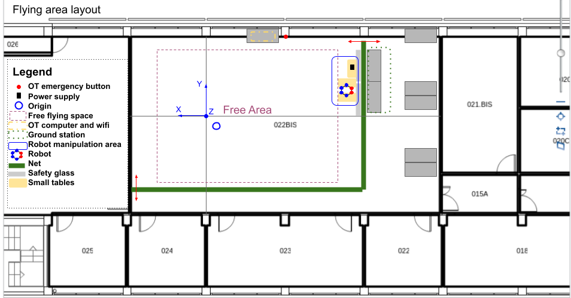
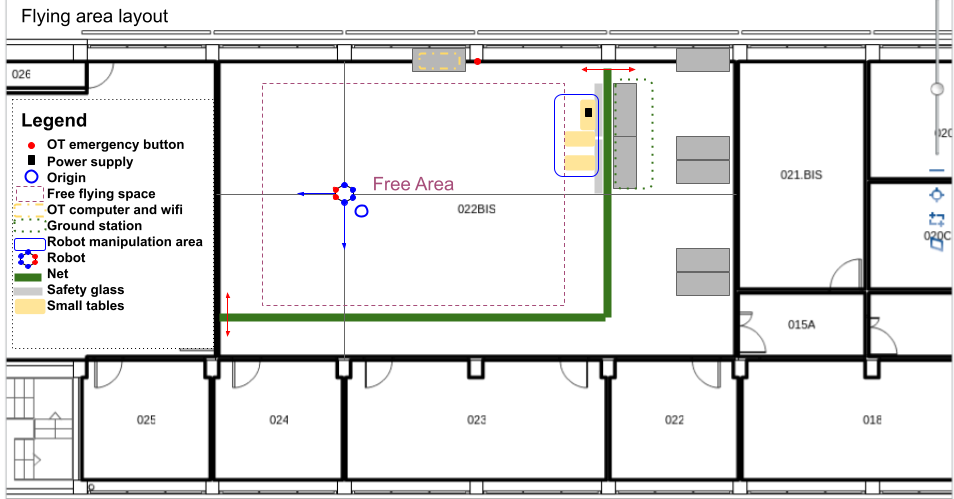

# Environment Setup
The following image is the layout of the laboratory flying area. Take it as a reference for the following instructions:

## Part 1: Flying Area Setup
1. Lay down the net using the strings close to the Workshop door.
2. Put the safety glass in front of the Ground Station's desks (should not be covered by the net).
3. Prepare the two tables for borinot manipulation: one leg on each table, the arm in between.
4. Prepare the table for the power supply. Set voltage to 22.5V and current limit to 3.0A.
5. Install the laptop computer in the Ground station.
6. Free the flying area.

## Part 2: OptiTrack Setup
1. Turn on OptiTrack cameras with the siwtch close to the OptiTrack's emergency button.
2. Turn on OptiTrack computer.
3. Take the robot out of the flying area (or put it in the closet).
4. Follow Optitrack calibration. In [iri_optitrack_how_to](https://gitlab.iri.upc.edu/labrobotica/ros/sensors/optitrack/iri_optitrack_how_to) you can find the general calibration method and all the Optitrack documentation. Here there is the basic isntructions to calibrate it for that project:
1. Open Motive. If the space was calibrated one or two days ago, you can open the last configuration. If it's not the case, start the calibration process.
2. Try to remove all the reflections in the area: Press mask visibles, go to a camera with masked points (red). Change view type to MPEG with the right click. See what is creating the reflection and try to remove it covering it or moving the object. Go back to object view with the right click. Unmask and re mask form visible to check if there are more reflections. Repeat until there is nothing more to do.
3. Press start wanding and do it. The wand is on top of the table drawer. For a good calibration each camera must have taken at least 3000 samples.
4. Calibrate. Check if the maximum distance is bigger than 8.0m and the mean error less than 1 mm.
5. Take the ground level marker form the desktop drawer and put it in the origin. The orientation is as shown in the following image (X points to the workshop, Z points to the windows).

6. Press ground level calibration.
7. Take the robot to the origin pointing to the wokshop. Check the following image for the robot orientation.

8. Select in motive all the markes and create a solid rigid from selected points. Name the created solid `borinot_fur_ot` which means:
  - name of the robot: borinot
  - reference frame: FUR (X-front, U-up, Z-right) -- see information on reference frames in [architecture](../architecture/README.md#software-for-state-estimation)
  - reference of system: OT: Opti-track
9. Select the center of the solid and the internal rear left marker and with the right click, set pivot point to selected marker.
10. Traslate rigid center to: (check error per markers + untrack markers) --> See [Helper](#helper-optitrack-imu-center-reference-frame) below.
  - x : 62.9 mm
  - y : 29.0 mm
  - z : 84.9 mm
11. Start the stream:
   - Inside Optitrack Streaming Engine:
     - Check that Local interface is `192.168.1.100`, if not, note the new `optitrack_interface` (you will have to modify files inside eagle_ros2) 
     - Check `Broadcast Frame Data`
   - Inside VRPN Streaming Engine:
     - Check that VRPN Broadcast Port is `3883`, if not, not the new `optitrack_port` (you will have to modify files inside eagle_ros2)
     - Check `Broadcast Frame Data`

### **Helper: Optitrack IMU center reference frame**

In Optitrack, follow these steps to set the IMU center reference frame:

1. Select (mouse left-click) the pivot marker in the solid

   

2. Also select (SHIFT + mouse left-click) the inner rear-left marker 

   

1. Set this second marker as pivot point (right-click -> Rigid Body -> Set Pivot Point to Selected Marker)

   

   You should see how the pivot moves to the selected marker

1. Select the Orientation tab to add the offsets of the IMU reference frame

   

5. Insert the XYZ offset values (in mm, not shown) and apply the transformation

   The values are:
      - x : 62.9
      - y : 29.0
      - z : 84.9

   

   You should see how the pivot moves to the center of the solid, a little above all the other markers.

<!-- # Preflight safety check list

Before each flight, it's important to perform a series of checks to ensure that the UAM is safe to operate. Follow the procedures outlined in the [preflight.md](preflight.md) file to complete these checks.

### Optitrack fusion

The [optitrack.md](optitrack.md) file provides a procedure for fusing the position of the OptiTrack system with the PX4's EKF2 module. -->

---
| [Top of page](#environment-setup) | [Back to Operations](./README.md) | [back to Borinot HOME](../README.md) | [Next → Borinot Bringup](2_borinot_bringup.md) |
| --- | --- | --- | --- |
