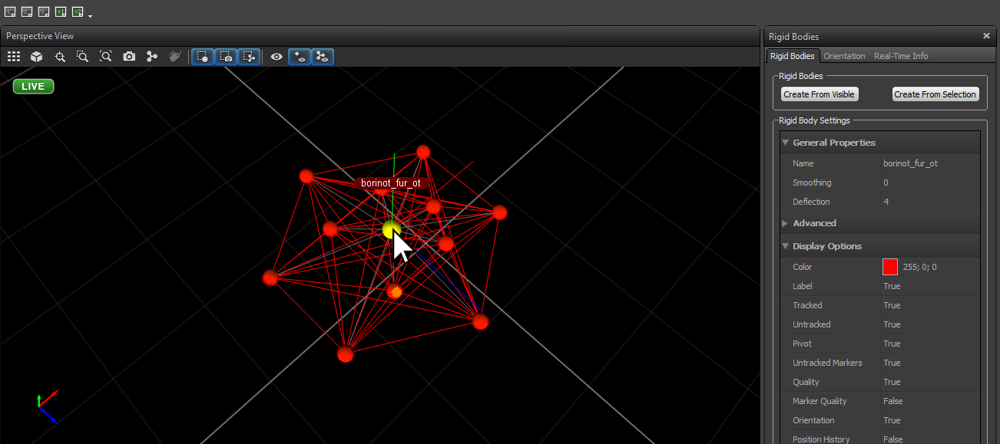
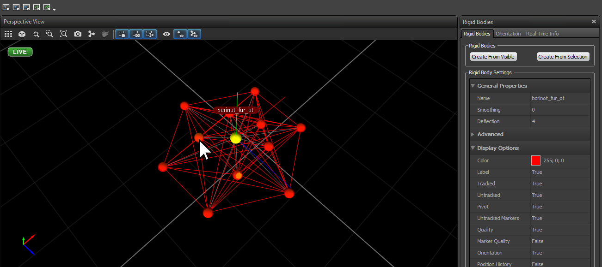
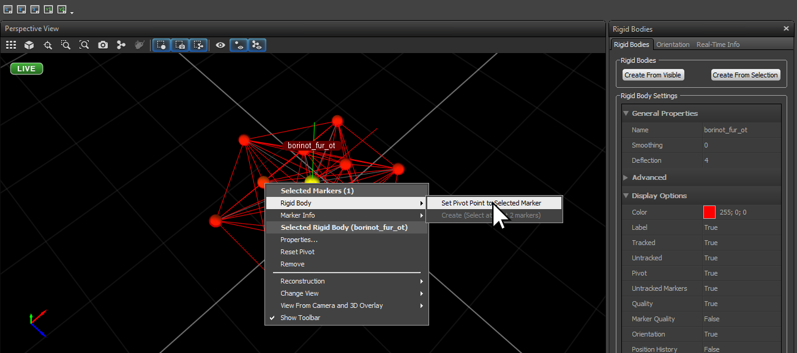
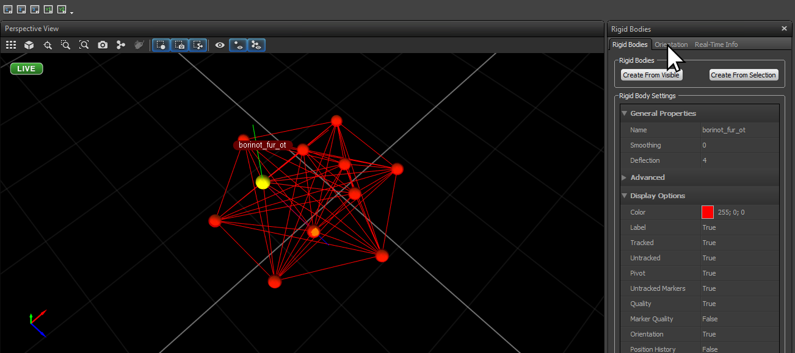
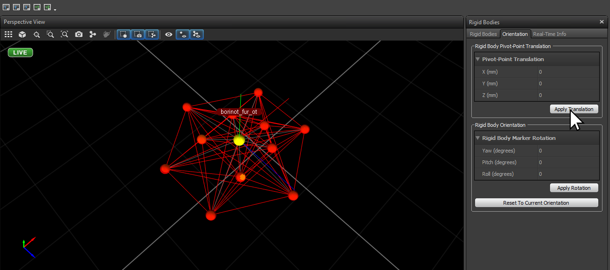

# Environment Setup

## Part 1: Flying Area Setup
1. Lay down the net using the strings close to the Workshop door
2. Put the safety glass in front of the desks (should not be covered by the net)
  - Top view od the lab with glass position, tables, little path [for manipulation] and net
3. Prepare the two tables for borinot manipulation: one leg on each table, the arm in between
4. Install power supply, set voltage to 22.5V
5. Install the laptop computer
6. **FREE THE FLYING AREA** (TODO: SHOW IT ON THE PICTURE)

## Part 2: Optitrack Setup
- Already documentation for the calibration in `iri_optitrack_how_to` (TODO: find the link)
- Add info about
  - pose of the origin (top view of the lab)
  - pose of Borinot when creating the "solid" (top view )
    - Put the drone on top of a table for all the cameras to detect it
  - the name convention `borinot_fur_ot`
  - origin and offset of the "imu center" (check error per markers + untrack markers) --> See [Helper](#helper-optitrack-imu-center-reference-frame) below.
    - origin : internal marker at the rear left (TODO: add image of markers and origin marker) 
      - x : 62.9
      - y : 29.0
      - z : 84.9
1. Start the stream:
  - Inside Optitrack Streaming Engine:
    - Check that Local interface is `192.168.1.100`, if not, note the new `optitrack_interface` (you will have to modify files inside eagle_ros2) 
    - Check `Broadcast Frame Data`
  - Inside VRPN Streaming Engine:
    - Check that VRPN Broadcast Port is `3883`, if not, not the new `optitrack_port` (you will have to modify files inside eagle_ros2)
    - Check `Broadcast Frame Data`

### **Helper: Optitrack IMU center reference frame**

In Optitrack, follow these steps to set the IMU center reference frame:

1. Select (mouse left-click) the pivot marker in the solid

   

2. Also select (SHIFT + mouse left-click) the inner rear-left marker 

   

1. Set this second marker as pivot point (right-click -> Rigid Body -> Set Pivot Point to Selected Marker)

   

   You should see how the pivot moves to the selected marker

1. Select the Orientation tab to add the offsets of the IMU reference frame

   

5. Insert the XYZ offset values (in mm, not shown) and apply the transformation

   The values are:
      - x : 62.9
      - y : 29.0
      - z : 84.9

   

   You should see how the pivot moves to the center of the solid, a little above all the other markers.

# Preflight safety check list

Before each flight, it's important to perform a series of checks to ensure that the UAM is safe to operate. Follow the procedures outlined in the [preflight.md](preflight.md) file to complete these checks.

### Optitrack fusion

The [optitrack.md](optitrack.md) file provides a procedure for fusing the position of the OptiTrack system with the PX4's EKF2 module.

| [Top of page](#environment-setup) | [Back to Operations](./README.md) | [back to Borinot HOME](../README.md) | [Next → Borinot Bringup](2_borinot_bringup.md) |
| --- | --- | --- | --- |
