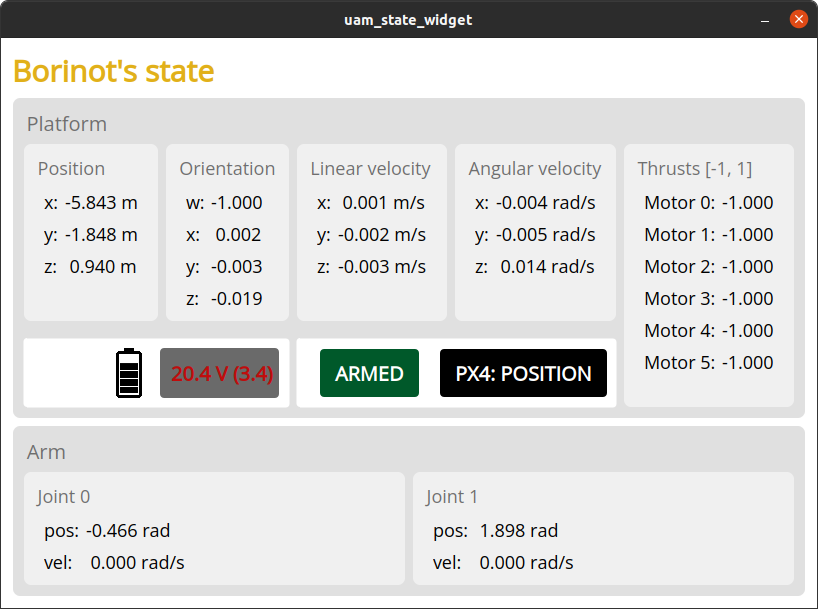
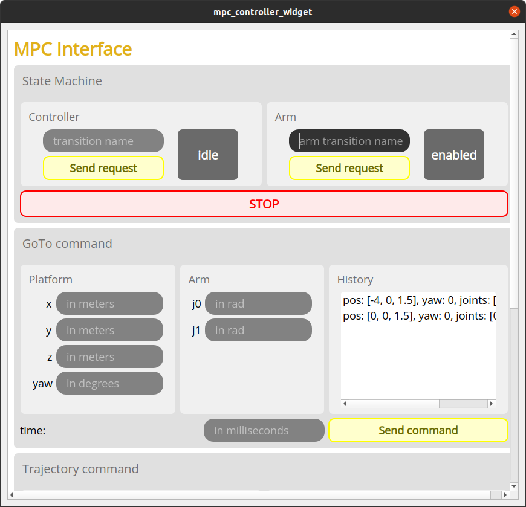

# Laptop Bringup

## Launch borinot Graphical User Interface

``` bash
rosgalactic_cyclone
ros2 launch eagle_ros2_viz bringup_gui.launch.py robot_name:=borinot_flying_arm_2
```


Two GUI windows are opened:
- [Borinot's State:](#borinot-state) Visualizer for Borinot internal state (pose, orientation, etc)
- [MPC Interface:](#mpc-interface) Control the mpc and the arm
> ⚠️⚠️ The MPC Interface is used to send commands: be careful about the values you are sending!! ⚠️⚠️

The two GUIs are explained below.


**Tip:** Don't close these windows between flight as you can load previous command through the History


### Borinot state

In **Borinot state** you can read the state of Borinot:

  

### MPC Interface

In **MPC Interface** you control the robot using MPC.

  

This GUI contains three sections:

1. **State Machine:** controls and displays the state machines of Borinot. There's the Controller state machine and the Arm state machine.

   In both cases, states and state transition commands are as follows:

   ```
              enable                 
   +------+   ------>   +---------+   start   +---------+
   | Idle |             | Enabled |  ------>  | Running |
   +------+   <------   +---------+           +---------+
       ∧      disable                              |
       |___________________________________________|
                          disable
   ```

   The button `STOP` will stop both state machines at once.

   To send commands, write the commands `enable`, `start` or `disable` in the 'transition name' window and press ENTER or click on 'send command'. The gray window on the right will display the new state.

2. **GoTo command**

   This section allows you to send waypoints to the controller. Follow these steps:
   - Enter desired XYZ and Yaw for the pose of the base, and j0, j1 for the arm angles.
   - Enter the travel time in milliseconds
   - Press ENTER or click 'Send command'

3. **Trajectory command**

   This section allows you to select a trajectory to execute. (⚠️ TODO revise)
   - Enter the trajectory name
   - Enter the controller type (use only RAIL MPC)
   - Enter the controller
   - Press ENTER or click 'send command' 


<!-- ## Additional procedures and troubleshooting

In addition to the preflight safety checklist, this page also contains documentation for other procedures that are necessary for operating the Borinot UAM. These include:


### [Troubleshooting](troubleshooting.md)

The [troubleshooting.md](troubleshooting.md) file contains a list of known issues and troubleshooting tips to help you quickly resolve problems that may arise during UAM operation.


If you encounter any difficulties during assembly or setup, our [Troubleshooting](resource/troubleshooting.md) section is here to help.

## How to Use Borinot
To use Borinot, we've made a set of guides to help you get started with it:

- [Preflight Checks](resource/preflight.md) - This document contains a checklist of preflight checks that must be performed before operating Borinot to ensure its safety and reliability.
- [Optitrack fusion](resource/optitrack.md) - This document explains how to fuse data from the Optitrack motion capture system and the PX4 flight controller to obtain accurate position and orientation estimates for Borinot.
- [MPC Controller](resource/mpc.md) - This document provides an overview of the Model Predictive Controller (MPC) used to control Borinot's hybrid locomotion, and explains how to run simulations and experiments with the controller. -->

---
| [Top of page](#laptop-bringup) | [Back to Operations](./README.md) | [back to Borinot HOME](../README.md) | [Next → Flight Procedure](4_flight_procedure.md) |
| --- | --- | --- | --- |
