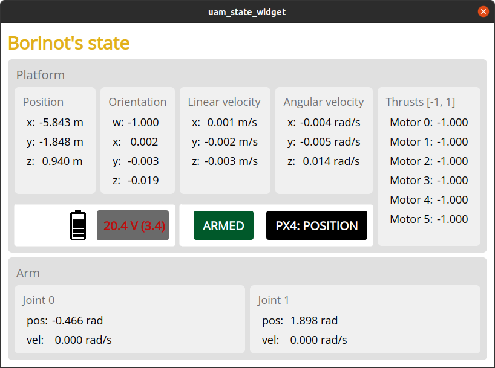

# Flight Procedure

⚠️ When flying with the MPC, two persons are required:
- one flying the drone (on the radio controller)
- one taking care of the MPC Interface (controlling state machine and MPC command)

TIPs: If you plan to use the MPC, put the trajectory + goto command directly into the MPC Interface launched on the laptop and restart the mpc launch file. This will save time (and battery) during flight

## Graphical User Interfaces.
From [Laptop Bringup](./3_laptop_bringup.md#laptop-bringup) you opened two GUI windows in the laptop: `Borinot state` and `MPC Interface`. 

### Borinot state
In **Borinot state** you can read the state of Borinot:

  

### MPC Interface
In **MPC Interface** you control the robot using MPC.

  

This GUI contains three sections:

1. **State Machine:** controls and displays the state machines of Borinot. There's the Controller state machine and the Arm state machine.

In both cases, states and state transition commands are as follows:

```
           enable                 
+------+   ------>   +---------+   start   +---------+
| Idle |             | Enabled |  ------>  | Running |
+------+   <------   +---------+           +---------+
    ∧      disable                              |
    |___________________________________________|
                       disable
```

The button `STOP` will stop both state machines at once.

To send commands, write the commands `enable`, `start` or `disable` in the 'transition name' window and press ENTER or click on 'send command'. The gray window on the right will display the new state.

2. **GoTo command**

This section allows you to send waypoints to the controller. Follow these steps:
  - Enter desired XYZ and Yaw for the pose of the base, and j0, j1 for the arm angles.
  - Enter the travel time in milliseconds
  - Press ENTER or click 'Send command'

3. **Trajectory command**

This section allows you to select a trajectory to execute. (⚠️ TODO revise)
  - Enter the trajectory name
  - Enter the controller type (use only RAIL MPC)
  - Enter the controller
  - Press ENTER or click 'send command' 

## Part 1: Radio-controlled flight in Position Control
1. Install the battery
   - Check that the battery is full (~25V)
   - The battery cable should face front and the power cable should point top (see picture)
   - disconnect the power supply
   - Try to position the cables in order to not let them free (and possibily touch a propeller)
   - Attach the battery with the scratch
2. Enable the arm
   - > ⚠️ be sure that nothing can block the arm's motion 
   - Laptop -> MPC interface -> state machine -> Arm -> write `enable` and send request
   - If the arm do not have the correct position, see troubleshoting
3. Move Borinot to the flying area
    - When moving Borinot, grab it from the Pixhawk case (avoid putting your hand in the propeller area)
    - Better to place it to the origin, with the front point to the x direction
    - Check if the pose estimate is converging
      - x ~ 0m
      - y ~ 0m
      - z ~ 0.19m
      - qw ~ 1
      - qx ~ 0
      - qy ~ 0
      - qz ~ 0
4. With the radio controller ⚠️ The drone will fly!! ⚠️ 
    - Set position control:
      - Put the `SWC` switch in the middle position
    - Check Borinot's state:
      - Laptop -> Borinot state GUI -> `PX4: POSITION`
    - Desactivate the KillSwitch (red switch, top position)
    - Arm the drone with the left joystick (pointing down/right)
    - Check if the motors are spinning properly, if something weird -> troubleshooting
    - Refer to this [link](https://docs.px4.io/main/en/flight_modes_mc/position.html) image for the command.
    - Take off slowly up
    - ⚠️ Trigger the jump
      - Climb slowly until you see borinot "jumping", then descend when the jump occurs
      - ⚠️ After each arming of Borinot, you have to trigger the jump,
      - After this, you are good to fly
    - If you want to use the MPC, read next part

## To stop the flight 

### Normal stop
1. Enable the arm,
   - Laptop -> MPC interface -> state machine -> Arm -> write `enable` and send request
2. Set position control: 
   - Radio, set the `SWC` switch in the down position.
3. Land Borinot with the radio,
4. Disable the motors 
   - Radio: left joystick down-left
5. ⚠️ Activate the KillSwitch
   - Radio: red switch down

### ⚠️ Mild emergency recovery ⚠️
1. Set position control: 
   - Radio: set the `SWC` switch in the down position.
   - The control is transferred from MPC to user
   - The robot will remain in the air in position
2. [Land the robot normally](#normal-stop)

### ⚠️⚠️⚠️ Severe emergency stop ⚠️⚠️⚠️
1. ⚠️ Activate the KillSwitch
   - Radio: red switch down
2. ⚠️ All motors will stop.
3. ⚠️ The robot will fall to the ground and crash. 

## Part 2: Automatic flight with EAGLE MPC 
1. > ⚠️ **FOLLOW POSITION CONTROL 1 TO 4 BEFORE THIS**
2. "Stabilize" Borinot in the air with the radio before proceeding further 
3. Enable the MPC `enable`
   - Laptop -> MPC interface -> state machine -> Controller ->  write  `enable` and send request
4. if enabled, arm the mpc with `start` command
   - Laptop -> MPC interface -> state machine -> Controller ->  write  `start` and send request
   - Borinot should stabilize and the arm will strech down, if not -> retake control (using the radio controller, switch to position control by pulling the `SWC` switch down)
5. To use the GoTo Command:
   - The origin is the same as specified for optitrack
   - The frame convention is flu (x: front, y: left, z: up)
6. To use the Trajectory command:
   - > ⚠️ ALWAYS USE RAIL MPC
   - trajectory : select one from `/home/hidro/libraries/eagle_mpc_lib/yaml/borinot_flying_arm_2/trajectories/`
   - warm start : **do not use**
   - mpc : `/home/hidro/libraries/eagle_mpc_lib/yaml/borinot_flying_arm_2/mpc/mpc.yaml`
7. You can lanuch multiple trajectories or goto commands.
8. When done, [stop the robot normally](#normal-stop)