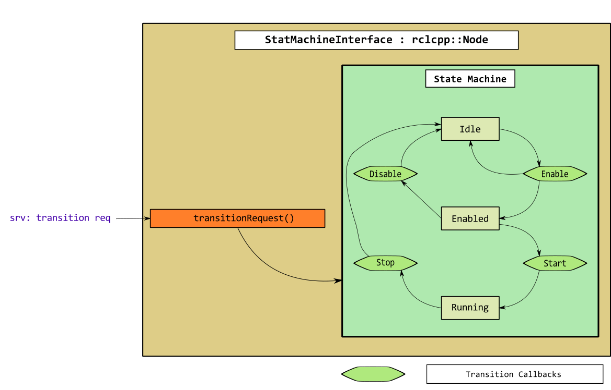

# Eagle ROS2: Control

This package contains different nodes that allow to interact with the UAM. There are some basic nodes that can be used to test more advanced control architectures.

## 1. Basic (abstract) nodes
The EagleMPC-ROS2 control package has several abstract (or base) classes. These, are common pieces used on a wide variety of control architectures for real robots.
1. We need to get the state estimation of the robot.
2. We need to compute a control (using some fancy algorithm) and send it to the actuators
3. It is good to have a state machine that ensures the good operation of the robot: a proper initialization of data structures and algorithms, a proper ending of algorithms, acceptable handling of unexpected situations, to provide a user interface, etc.

This package contains these pieces implemented as abstract classes. The idea is to build our final control architecture inheriting from the ones that we need. In the following, there is a small explanation of each one of them.

### 1.1 State subscriber & publisher
This node subscribes to different topics containing the state of the robot and publishes the state in one single message. All the callback sbelong to a `callback_group` to ease the running of this node (and its eventual derived ones) on a `MultithreadExecutor`.

Even being a base class, it can still be run as a stand-alone node. The steps to get this node running in simulation are the following:

> :information_source: To gain insight into the detailed launching procedure [go here](../../../procedures/preflight.md). This procedure is automatized by means of ROS2 launch files.

1. Start the PX4 simulation:
```console
foo@bar:~/$ cd <path-to-px4-autopilot>
foo@bar:<path-to-px4-autopilot>/$ make px4_sitl_rtps gazebo
```
2. In a second terminal, source your ROS2 workspace and run the following command:
```console
foo@bar:<path-to-ros2-ws>/$ ros2 launch eagle_ros2_control state_pub_sub.launch.py
```
3. In a third, confirm that the state is being published as a single message:
```console
foo@bar:<path-to-ros2-ws>/$ ros2 topic echo /platform_state
```

### 1.2 Base controller

This provides the basic functionality to write commands to the UAM actuators (thrust and torque). It is built as a pure virtual class. As such, it must be derived in a separate class so that it can be used.

It has only one pure virtual function called `computeControls()`, which is where the derived classes will call the control algorithms to get the controls for the robot. This is called in its own callback group and, therefore, it is easy to assign an own thread when doing the final node executor. This function is called at fixed rate, specified by a parameter.

Since it is a pure virtual class, it cannot be launched as a standalone application.

### 1.3 State machine

Generally, to have an operating robot, we need to go through different launch procedures. In these, we make sure that every single subsystem is properly initialized. To ease these procedure we have implemented an abstract class containing a state machine.



**FINISH EXPLANATION!**

## 2. Utility (derived) nodes
### 2.1 Control Manager Interface
This is a node with a more advanced functionality. Contains the machinery to run the control based on MPC.

[See here](ctrl_mgr_interface.md) for more info.

### 2.2 Decentralized controller
This is a node to control separately the flying platform and the robotic arm of a UAM.

[See here](decentralized_controller.md) for more info.


[Back to Eagle MPC - ROS2](../README.md)