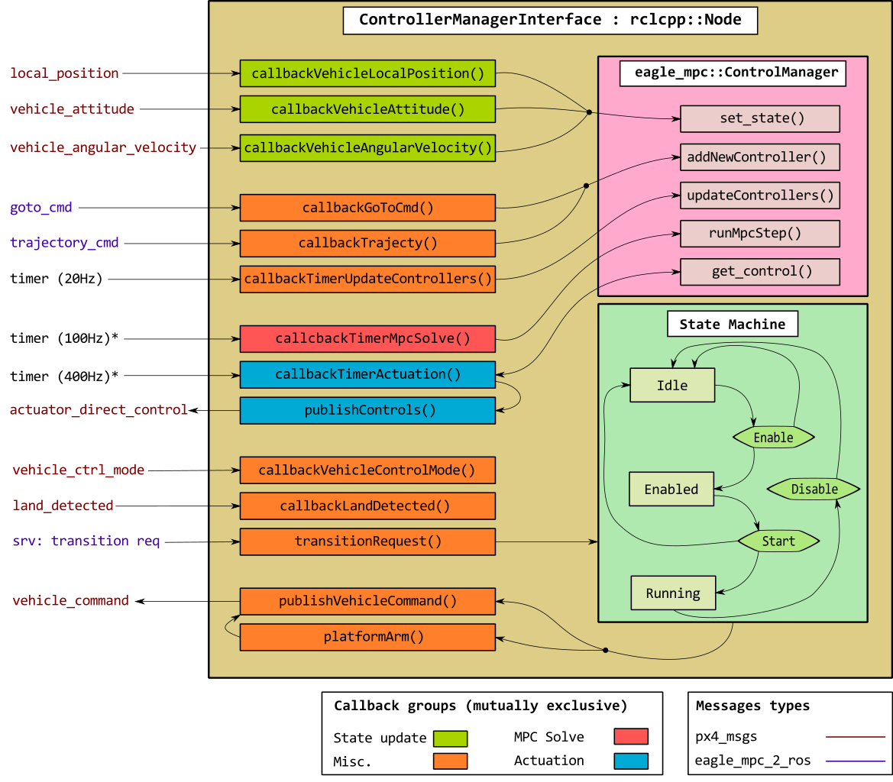

# Eagle MPC ROS2: Control -> MPC Controller
This node incorporates functionalities to interact with the UAM by using the `eagle_mpc::ControlManager` object. This object is in charge of ensuring a continuous operation of the UAM using MPC controllers (see diagram below).

What the node **DOES NOT** do:
- To manage the MPC controllers or any other algorithmic issue related to the MPC algorithm. This is left for the class [`eagle_mpc::ControlManager`](https://github.com/hidro-iri/eagle_mpc_lib/blob/devel/include/eagle_mpc/controller-manager.hpp).

What the node **DOES**:
- To address the robot's state data coming both from PX4 and the ODRI master board.
- To address the actuator's commands computed by the `eagle_mpc::ControlManager` to the corresponding actuator topics/drivers.
- To manage a state machine to safely operate the UAM.

You can skip the implementation details and go directly to the [practical details](#2-operation) about how to operate a UAM with this node.

## 1 Architecture

Let us explain its functionality with the help of the diagram below:



### 1.1 State machine

The node is governed by a state machine with three main states:

- **Idle**: The base is `disarmed` if the UAM is `landed`. Flight mode is the PX4-standard `pos_ctl`. Nothing is being published to `vehicle_command` topic.
- **Enabled**: The base is `armed` and the UAM `landed`. Flight mode is the custom `direct-control` mode. Zeros are being published to the `vehicle_command` topic waiting for the first MPC solution to be computed.
- **Running**: The base is armed and the UAM `flying`. Flight mode is the custom `direct-control` mode. The MPC controls are being published to the `vehicle_command` topic.

There is a ROS2 service to ask for a transition to occur. When this service is called, the callback `transitionRequest` is executed. If the right conditions are met, the state transitions from the current state to the requested one. 

- **Idle** &#8594; **Enabled**:
  - State machine must be **Idle**
  - The `MicroRTPS Agent` must be running and publishing to the state topics.
  - Vehicle must be landed.
- **Enabled** &#8594; **Running**: this transition is done automatically once the PX4 landed flag is set to false. Conditions checking happens inside `callbackLandDetected()`.
  - State machine must be **Enabled**
  - Vehicle must be landed
  - Not landed flag received in the callback message.
  - Motor Control flight mode must be enabled.
- **Running** &#8594; **Idle**:
  - State machine must be **Running**

### 1.2 Callbacks
The node spins in a multithreaded executor. Each callback is assigned to a `callback_group`, which is mutually exclusive. That is, for a specific `callback_group`, one and only one callback from this group can be executed simultaneously. In our case, as we have four groups, at maximum there will be four callbacks executing simultaneously.

These are the `callback_groups`:
- **State update** (callbacks in green), *time-critical*: 
  - Callbacks of subscribers for topics carrying robot's state information (e.g. position, attitude, joint configuration, ...).
  - Always updating state in the `ControlManager` object.
- **Controls update** (callback in blue), *time-critical*: 
  - the only callback in this group is responsible for getting the control from the `eagle_mpc::ControlManager` and publish it oto the  `actuator_direct_control` topic.
- **MPC solve** (callback in red), *time-critical*: 
  - the only callback in this group is responsible for calling. `eagle_mpc::ControlManager::runMpcStep()`.
- **Miscellaneous** (callback in orange) *time-non-critical*:
  - callbacks related to the PX4 status.
  - callbacks interacting with the state machine (e.g. change the flight mode).
  - callback to update the status of the `eagle_mpc::ControlManager` object.
  - callbacks for the topics carrying mission commands, i.e., `callbackGoToCmd` and `callbackTrajectoryCmd`

## 2 Operation

### 2.1 Build with the appropriate messages
To run this node you should first have compiled the `PX4-Autopilot` and the `px4_ros_com` by using the messges in `px4_control_msgs.yaml` and `ros2_control_msgs.yaml`, respectively.

[Build procedure](../README.md#2-build)

### 2.2 Launch the required systems

1. Start the PX4 simulation:
```console
foo@bar:~/$ cd <path-to-px4-autopilot>
foo@bar:<path-to-px4-autopilot>/$ make px4_sitl_rtps gazebo
```
2. In a second terminal, source your ROS2 workspace and run the following command:
```console
foo@bar:<path-to-ros2-ws>/$ ros2 launch eagle_ros2_control mpc_controller.launch.py
```
3. In a third termimal, publish a GoTo command:
```console
foo@bar:~$ ros2 topic pub -1 /goto_command eagle_mpc_2_interfaces/msg/GoToCmd "{platform_pos:{x: 0, y: 0, z: 2}, platform_yaw: 90, time: 2500}"
```
4. Now, you can enable the MpcController:
```console
foo@bar:~$ ros2 service call /mpc_controller/state_transition eagle_mpc_2_interfaces/srv/TransitionCommand "{command: enable}"
```

[Back to Eagle MPC - ROS2 Control](README.md)
